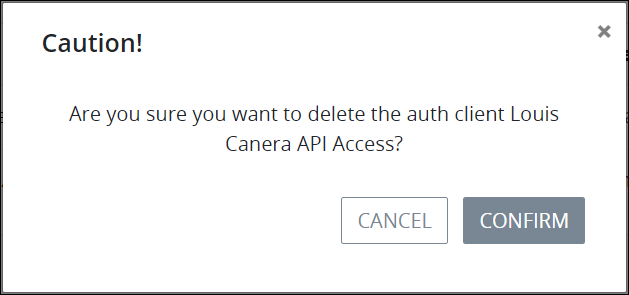

# Delete a Client Authentication Key

## Delete a Client Authentication Key


Your user account or group membership must have the following permissions to delete a client authentication key:

* Auth-Clients: View Auth-Clients
* Auth-Clients: Delete Auth-Clients

See the [Auth-Clients](../../permission-descriptions-for-users-and-groups.md#auth-clients) permissions or ask your ProcessMaker Administrator for assistance.



When a client authentication key is deleted, it can no longer be used to access the [ProcessMaker 4 REST API](https://develop-demo.bpm4.qa.processmaker.net/api/documentation).

Deleting a client authentication key from the **Auth Clients** page cannot be undone.


Follow these steps to delete a client authentication key:

1. [View all client authentication keys.](view-all-client-authentication-keys.md#view-all-scripts) The **Auth Clients** page displays.
2. Select the **Delete** iconfor the client authentication key. The **Caution** screen displays to confirm the deletion of the client authentication key.  

   

3. Click **Confirm**.

## Related Topics









