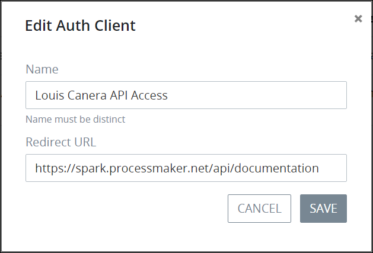

# Edit a Client Authentication Key

## Edit a Client Authentication Key

Follow these steps to edit a client authentication key that grants access to the [ProcessMaker 4 REST API](https://develop-demo.bpm4.qa.processmaker.net/api/documentation):

1. [View all client authentication keys.](view-all-client-authentication-keys.md#view-all-scripts) The **Auth Clients** page displays.
2. Select the **Edit** icon for the client authentication key to edit. The **Edit Auth Client** screen displays.  

   

3. Edit the following information about the client authentication key as necessary:
   * In the **Name** field, edit the name of the client authentication key. ~~This is a required field.~~
   * In the **Redirect URL** field, edit the URL that redirects the authenticated client back to the ProcessMaker 4 application. ~~This is a required field.~~
   * In the **Client Secret** field, edit the unique Client Secret for the client authentication key. ~~This is a required field.~~
4. Click **Save**.

## Related Topics









