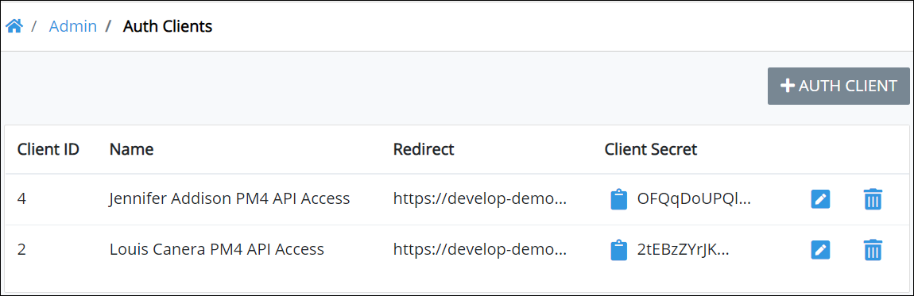

# View All Client Authentication Keys

## View All Client Authentication Keys 

ProcessMaker displays all client authentication keys to access the [ProcessMaker 4 REST API](https://develop-demo.bpm4.qa.processmaker.net/api/documentation) in one table that ProcessMaker Administrators throughout your organization have created. This makes it easy to manage client authentication keys. Client authentication keys display the most recently created keys at the top of the table.


Your user account or group membership must have the "Auth-Clients: View Auth-Clients" permission to view the list of client authentication keys.

See the [Auth-Clients](../../permission-descriptions-for-users-and-groups.md#auth-clients) permissions or ask your ProcessMaker Administrator for assistance.


Follow these steps to view all client authentication keys granted access to the ProcessMaker 4 REST API:

1. [Log on](../../../using-processmaker/log-in.md#log-in) to ProcessMaker.
2. Click the **Admin** option from the top menu. The **Users** page displays.
3. Click the **Auth Clients** icon. The **Auth Clients** page displays all client authentication keys. 

The **Auth Clients** page displays the following information in tabular format about client authentication keys that can access the ProcessMaker 4 REST API:

* **Client ID:** The **Client ID** column displays the Client ID for the key. ProcessMaker 4 automatically generates the Client ID value when the key is created and represents a sequential number of how many total keys have been created to that time.
* **Name:** The **Name** column displays the unique name of the key. See [Create a New Client Authentication Key](create-a-new-client-authentication-key.md).
* **Redirect:** The **Redirect** column displays the URL that redirects the authenticated client back to the ProcessMaker 4 application. See [Create a New Client Authentication Key](create-a-new-client-authentication-key.md).
* **Client Secret:** The **Client Secret** column displays the Client Secret for the key. ProcessMaker 4 automatically generates the Client Secret value when the key is created. Click the **Copy Client Secret to Clipboard** iconto copy the Client Secret. Paste the Client Secret into your application to access the ProcessMaker 4 REST API.


### Edit a Client Authentication Key

Click the **Edit** icon. See [Edit a Client Authentication Key](edit-a-client-authentication-key.md).

### Create a Client Authentication Key

Click the **+Auth Client** button. See [Create a New Client Authentication Key](create-a-new-client-authentication-key.md#create-a-client-authentication-key).

### Delete a Client Authentication Key

Click the **Delete** icon. See [Delete a Client Authentication Key](delete-a-client-authentication-key.md#delete-a-client-authentication-key).

### No Client Authentication Keys?

If no Client authentication keys have been created, the following message displays: **No Data Available**.

### Display Information the Way You Want It

[Control how tabular information displays](../../../using-processmaker/control-how-requests-display-in-a-tab.md), including how to sort columns or how many items display per page.


## Related Topics









