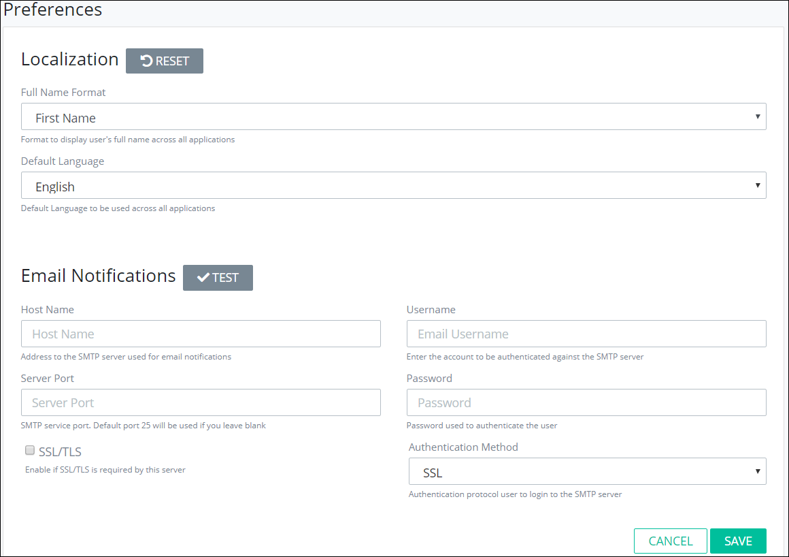

# ProcessMaker Preferences


To set ProcessMaker preferences, you must be a member of the ProcessMaker Administrator group. Otherwise, the **Admin** option is not available from the top menu that allows you to set ProcessMaker preferences.


## Set ProcessMaker Preferences

Follow these steps to set ProcessMaker preferences:

1. [Log in](../using-processmaker/log-in.md#log-in) to ProcessMaker.
2. Click the **Admin** option from the top menu. The **Users** page displays.
3. Click the **Preferences** icon. The **Preferences** page displays.  

   

4. Use the **Localization** section to specify language and format settings in ProcessMaker. Follow these guidelines:
   1. Select from the **Full Name Format** drop-down how full names display in ProcessMaker from the following options:
      * **First Name:** Full names display with the first name preceding the last name.
      * **Last Name:** Full names display with the last name preceding the first name.
   2. Select from the **Default Language** drop-down the language ProcessMaker displays throughout the application.
   3. Click **Reset** to reset the Localization section settings to default settings if necessary. 
5. Use the **Email Notifications** section to specify email delivery settings. These settings allow ProcessMaker to send email notifications. Follow these guidelines:
   1. Enter in the **Host Name** field the host name or IP address to the SMTP server used for email notifications.
   2. Enter in the **Server Port** field the SMTP server port the ProcessMaker application uses to send email notifications. The default port is 25. The default port is used if you do not enter a value.
   3. Select the **SSL/TLS** checkbox if SSL/TLS is required by this server.
   4. Enter in the **Username** field the username for the account to be authenticated against the SMTP server.
   5. Enter in the **Password** field the password for the account to be authenticated against the SMTP server.
   6. Select from the **Authentication Method** drop-down the authentication protocol to log in to the SMTP server:
      * SSL
      * GSSAPI
      * NTLM
      * MD5
      * Password
   7. Click **Test** to test your email settings that they properly access the email server.
6. Click **Save**. Otherwise, click **Cancel** to not change any ProcessMaker preferences.

