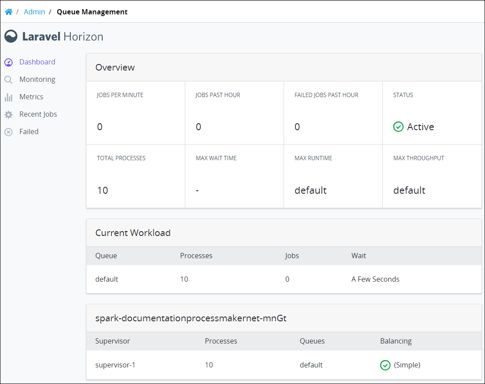

# Dashboard

The Queue Management Dashboard displays an overview of your ProcessMaker 4 server's status. The Dashboard displays by default in Queue Management.

Follow these steps to view the Queue Management Dashboard:

1. [Log in](../../using-processmaker/log-in.md#log-in) to ProcessMaker.
2. Click the **Admin** option from the top menu. The **Users** page displays.
3. Click the **Queue Management** icon. The Queue Management Dashboard displays.


Click **Dashboard** to view the Dashboard from another Queue Management page.


The Dashboard displays in the **Overview** panel the following metrics about your ProcessMaker server:

* **Jobs Per Minute:** The **Jobs Per Minute** metric displays how many [jobs](what-is-queue-management.md#jobs) per minute on average ran through the [queue](what-is-queue-management.md#queues).
* **Jobs Past Hour:** The **Jobs Past Hour** metric displays how many jobs ran in the queue in the past hour.
* **Failed Jobs Past Hour:** The **Failed Jobs Past Hour** metric displays how many queued jobs failed in the past hour. See [View Recently Failed Jobs](view-recently-failed-jobs.md).
* **Status:** The **Status** metric displays the status of the ProcessMaker 4 server. The following status types are possible:
  * **Active:** The ProcessMaker 4 server is active.
  * **Inactive:** The ProcessMaker 4 server is inactive.
  * **Error:** The ProcessMaker 4 server has an error.
* **Total Processes:** The **Total Processes** metric displays how many computer server processes ProcessMaker 4's server is using.
* **Max Wait Time:** The **Max Wait Time** metric displays the maximum wait time ~~\(in what units of time?\)~~ the queue has required to run a recent job. ~~If the wait time is negligible, then this metric displays the following: **-**.~~
* **Max Runtime:** The **Max Runtime** metric displays the maximum runtime to run a queued job ~~\(in what units of time?\)~~. ~~If the maximum runtime is negligible, then this metric displays the following: **default**.~~
* **Max Throughput:** The **Max Throughput** metric displays the maximum queue throughput \(in what units?\). ~~If the maximum throughput is negligible, then this metric displays the following: **default**.~~

The Dashboard displays in the **Current Workload** panel the following information about your ProcessMaker server:

* Queue: 
* Processes: 
* Jobs: 
* Wait: 

## Related Topics











