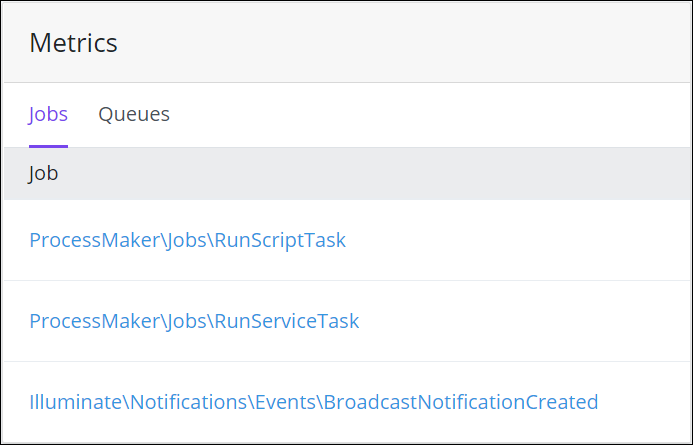
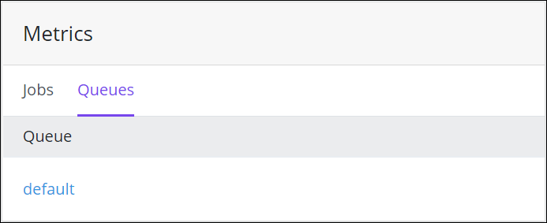

# View Metrics

## Overview

Queue Management displays job and queue metrics in the **Metrics** panel.

Follow these steps to view the **Metrics** panel in Queue Management:

1. [View Queue Management](dashboard.md). The Dashboard displays.
2. Select the **Metrics** link. The **Metrics** panel displays.

## View Job Metrics

Follow these steps to view job metrics in Queue Management:

1. [View the Metrics panel in Queue Management](view-metrics.md#overview). The **Jobs** tab displays recently run jobs.  

   

2. Click a recently run job to view throughput and runtime metrics for that job.

## View Queue Metrics

Follow these steps to view queue metrics in Queue Management:

1. [View the Metrics panel in Queue Management](view-metrics.md#overview). The **Jobs** tab displays.
2. Click the **Queues** tab to display all queues in ProcessMaker 4.  

   

3. Click a queue to view throughput and runtime metrics for that queue.

## Related Topics











