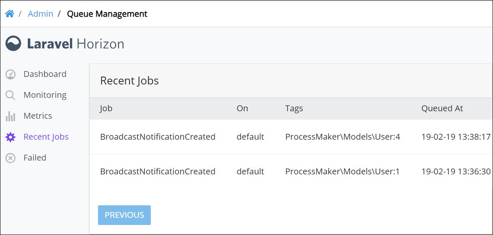

# View Recent Jobs

## Overview

Queue Management displays a table of recently run jobs in the **Recent Jobs** panel.

Follow these steps to view the **Recent Jobs** panel in Queue Management:

1. [View Queue Management](dashboard.md). The Dashboard displays.
2. Select the **Recent Jobs** link. The **Recent Jobs** panel displays.

The **Recent Jobs** panel displays the following information about recently run jobs:

* **Job:** The **Job** column displays the name of the recently run job.
* **On:** The **On** column displays the name of the queue from which the job ran.
* **Tags:** The **Tags** column displays the tag\(s\) associated with the job.
* **Queued At:** The **Queued At** column displays the date and time in which the job entered its queue.

If more than ~~nine \(9\)~~ jobs display in the **Recent Jobs** panel, then the following occurs:

* The **Next** navigation button displays.
* The **Previous** navigation button enables.

Use the **Next** and **Previous** navigation buttons to navigate multiple pages of recently run jobs.

## Related Topics











