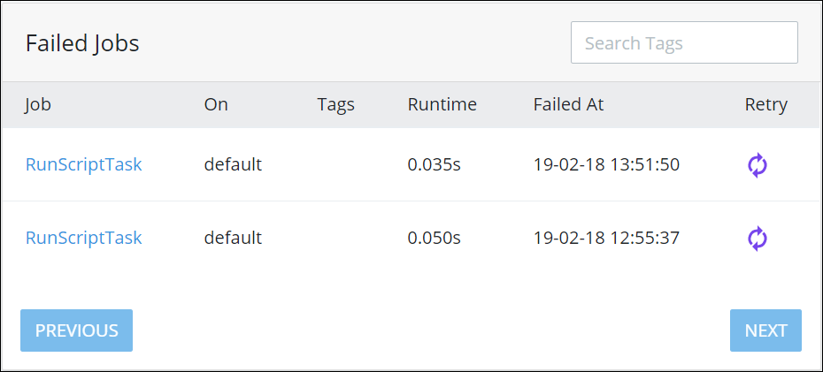

# View Recently Failed Jobs

## Overview

Queue Management displays a table of [failed jobs](what-is-queue-management.md#failed-jobs) in the **Failed Jobs** panel.

Follow these steps to view the **Failed Jobs** panel in Queue Management:

1. [View Queue Management](dashboard.md). The Dashboard displays.
2. Select the **Failed** link. The **Failed Jobs** panel displays.

The **Failed Jobs** panel displays the following information about failed jobs:

* **Job:** The **Jobs** column displays the name of the failed job. Click the failed job's name to view the error\(s\) associated with the failed job. Optionally, click the Retry iconto retry running the failed job.
* **On:** The **On** column displays the name of the queue from which the job failed.
* **Tags:** The **Tags** column displays the tag\(s\) associated with the job.
* **Runtime:** The **Runtime** column displays how much time in seconds the failed job ran.
* **Failed At:** The **Failed At** column displays the date and time the job failed.
* **Retry:** Click the **Retry** iconfor the failed job to retry running it.

If more than ~~nine \(9\)~~ failed jobs display in the **Failed Jobs** panel, then the **Next** and **Previous** navigation buttons enable. Use the **Next** and **Previous** navigation buttons to navigate multiple pages of failed jobs.

## Related Topics











