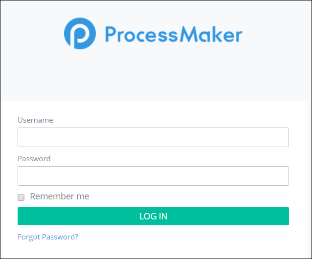

# Log In


Please contact your ProcessMaker Administrator if you do not know either of the following:

* the web address to access the ProcessMaker log in screen
* your ProcessMaker log in credentials

Did you forget your password? See [Log In](log-in-to-processmaker.md#reset-your-password).


## Log In

Follow these steps to log in:

1. Enter the IP address \(or domain name\) and port number for the server or instance hosting ProcessMaker in a [supported web browser](../install-processmaker/prerequisites/supported-browsers.md#browser-support-policy). Follow these guidelines:

   `http://<IP-Address>:<Port-Number>`

   For example, if running ProcessMaker at the IP address 192.168.1.110 from the port 3018, then enter: `http://192.168.1.110:3018`.

   The ProcessMaker log in screen displays.  

   

2. Enter your ProcessMaker username in the **Username** field.
3. Enter your ProcessMaker password in the **Password** field.
4. Click the **Remember me** check box to not enter your log in credentials in the future.
5. Click **Login**.

## Reset Your Password

