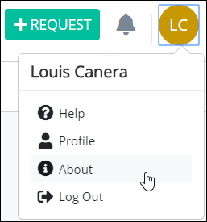

# View ProcessMaker Version Information

## View ProcessMaker Version Information

Follow these steps to view ProcessMaker version information:

1. [Log in](log-in.md#log-in) to ProcessMaker.
2. Click your user avatar, and then select **About**.  

   

   The **About ProcessMaker 4** page displays.  


Click **Report an issue** to [report a ProcessMaker issue](https://github.com/ProcessMaker/bpm/issues).

Click **Get Help** to display the [ProcessMaker's **bpm** GitHub repository page](https://github.com/ProcessMaker/bpm).


