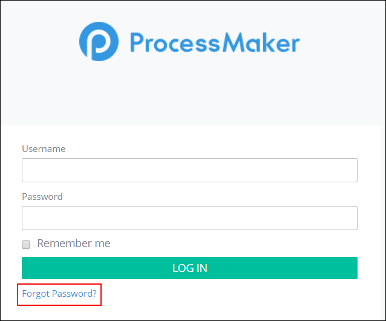

# Log In to ProcessMaker

## Log In


Please contact your ProcessMaker Administrator if you do not know either of the following:

* the web address to access the ProcessMaker log in page
* your ProcessMaker log in credentials

Did you forget your password? See [Reset Your Password](log-in.md#reset-your-password).


Follow these steps to log in to ProcessMaker 4:

1. Enter the IP address \(or domain name\) and port number for the server or instance hosting ProcessMaker in a [supported web browser](../install-processmaker/prerequisites.md#supported-browsers). Follow these guidelines:

   `http://<IP-Address>:<Port-Number>`

   For example, if running ProcessMaker at the IP address 192.168.1.110 from the port 3018, then enter: `http://192.168.1.110:3018`.

   If the web address is correct, the ProcessMaker log in page displays.  

   

2. In the **Username** field, enter your ProcessMaker username.
3. In the **Password** field, enter your ProcessMaker password.
4. Optionally, select the **Remember me** check box to not enter your log in credentials in the future.
5. Click **Log In**. If the log in credentials are correct, the [**My Requests**](requests/view-started-requests.md#view-requests-you-started) page displays.

## Reset Your Password

Follow these steps to reset your ProcessMaker 4 password:

1. Access the ProcessMaker log in page as described in [Log In](log-in.md#log-in). If you do not know the web address to access the ProcessMaker log in page, ask your ProcessMaker Administrator for assistance.
2. Click the **Forgot Password?** link as highlighted below.  

   

   The **Forgot Your Password?** page displays.  

   

3. In the **Email Address** field, enter the email address to which to send a reset link.

   If you enter an email address which your ProcessMaker instance does not recognize, the following message displays in red-colored text below the **Email Address** field: **We can't find a user with that email address**.

4. Click **Request Reset Link**.
5. Check your email for the instructions to reset your password.
6. After you select the link in that email to reset your password, click the **Back to Login** link to return to the log in page.
7. Log in to ProcessMaker 4 as described in [Log In](log-in.md#log-in).

## Related Topics







