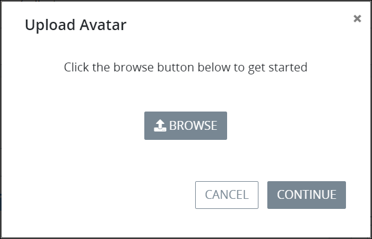
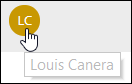
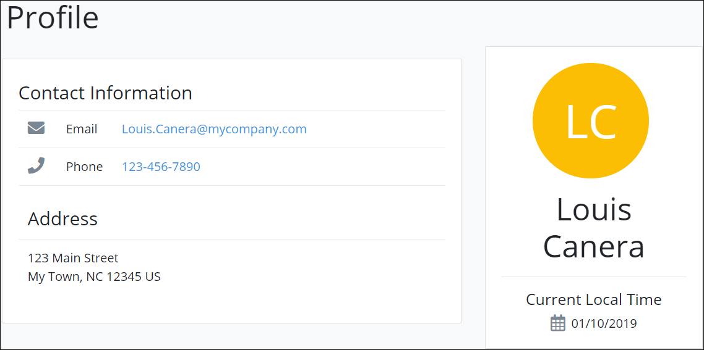

# Profile Settings

## Access Your Profile

Follow these steps to access your profile settings:

1. [Log in](log-in.md#log-in) to ProcessMaker.
2. Click your user avatar, and then select **Profile**.  

   

   The **Profile** page displays. See [Change Your Profile Settings](profile-settings.md#change-your-profile-settings).  

## Change Your Profile Settings


Passwords must adhere to the following protocol:

* Passwords must be at least eight \(8\) characters long.
* [Password special characters](https://www.owasp.org/index.php/Password_special_characters) are recommended.


Follow these steps to change your profile settings:

1. [Access your profile.](profile-settings.md#access-your-profile) The **Profile** page displays.  

   

2. The ProcessMaker Administrator may have entered some profile settings when your user account was created. Follow these guidelines to change your profile information if necessary:
   * In the **Name** section, change the following information:
     * In the **First Name** field, enter your first name.
     * In the **Last Name** field, enter your last name.
   * In the **Contact Information** section, change the following information:
     * In the **Email** field, enter your business email address. This is a required field.
     * In the **Phone** field, enter your business telephone or cell phone number.
   * In the **Address** section, change the following information:
     * In the **Address** field, enter your business address.
     * In the **City** field, enter the city for your business address.
     * From the **State or Region** drop-down, select the state, region, or province for the person's business address.
     * In the **Postal code** field, enter your business postal code.
     * From the **Country** drop-down menu, select the country for your business address.
   * In the **Localization** section, change the following information:
     * In the **Date format** drop-down, select the format for how dates are displayed from the following options:
       * m/d/Y \(12/31/2017\)
       * m/d/Y h:i A \(12/31/2017 11:30 pm\)
       * m/d/Y H:i \(12/31/2017 23:30\)
     * From the **Time zone** drop-down, select the time zone in which to display times.
     * From the **Language** drop-down, select in which language to display ProcessMaker labels.
3. Select the avatar image to change the avatar for the ProcessMaker user account if necessary. If there is no avatar image, the initials of your full name display. When the avatar image is selected, the **Upload Avatar** screen displays to select a new avatar image. Click the **Browse** button to locate the new avatar image. After selecting the new image click **Continue** from the **Upload Avatar** screen.  

   

4. In the **Username** field, change your username if necessary. This is a required field.
5. Follow these guidelines to change your password if necessary:
   * In the **New Password** field, enter your new password. Leave the **New Password** field blank to keep the current password. Password validation indicates how strong your password is if you enter a new password.
   * In the **Confirm Password** field, confirm that the password matches that entered into the New Password field if a new password is entered. If you entered a new password, password validation indicates if the **New Password** and **Confirm Password** values do not match.
6. Click **Update**.

## View Another User's Profile Information

To view another user's profile information, select that person's avatar.

After that user's avatar is selected, that person's profile information displays. Each user is responsible for profile content.


Hover your mouse over a user's avatar to view that person's full name.


## Related Topics





