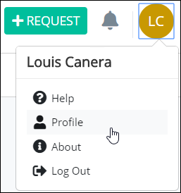
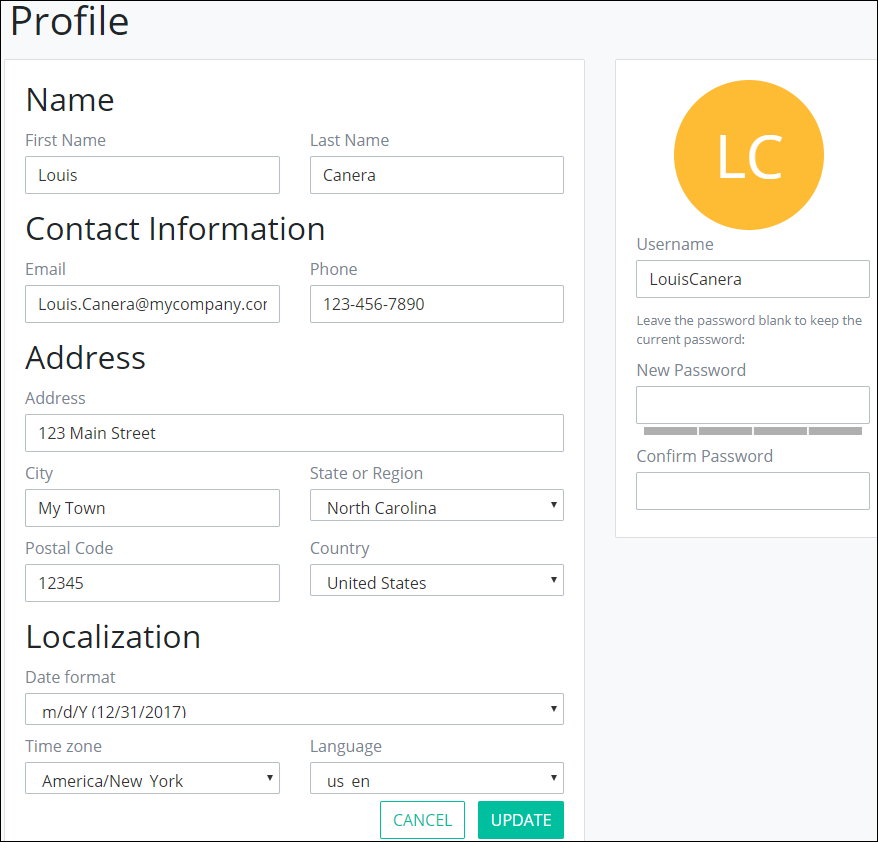

# Profile Settings

## Access Your Profile

Follow these steps to access your profile settings:

1. [Log in](log-in.md#log-in) to ProcessMaker.
2. Click your user avatar, and then select **Profile**.  

   

   The **Profile** page displays.

## Change Your Profile Settings

Follow these steps to change your profile settings:

1. [Access your profile.](profile-settings.md#access-your-profile) The **Profile** page displays.  

   

2. The ProcessMaker Administrator may have entered some profile settings when your user account was created. Follow these guidelines to change your profile information:
   * Enter your first name in the **First Name** field.
   * Enter your last name in the **Last Name** field.
   * Enter your email address in the **Email** field.
   * Enter your phone number in the **Phone** field.
   * Enter your physical address in the **Address** field.
   * Enter the city in which you work in the **City** field.
   * Select the state, region, or territory in which you work in the **State or Region** drop-down menu.
   * Enter the Postal code in which you work in the **Postal code** field.
   * Select the country where you work from the **Country** drop-down menu.
   * Select in which timezone you work from the **Timezone** drop-down menu.
   * Select in which language to display ProcessMaker field labels from the **Language** drop-down menu.
3. Click **UPDATE** to save changes to your profile. Otherwise, click **CANCEL**.

## Change Your Account Username or Password

Passwords must follow the following protocol:

* ~~What is the protocol for passwords? How long should they be? Special characters and numbers? Capital letters?~~

Follow these steps to change your account password:

1. [Access your profile.](profile-settings.md#access-your-profile) The **Profile** page displays.

   

2. Change your username in the **Username** field if necessary.
3. To change your password, follow these guidelines:
   * Enter your new password in the **New Password** field.
   * Confirm your new password by duplicating what you entered into the **New Password** field.
4. Click **UPDATE** to save changes to your profile. Otherwise, click **CANCEL**.

