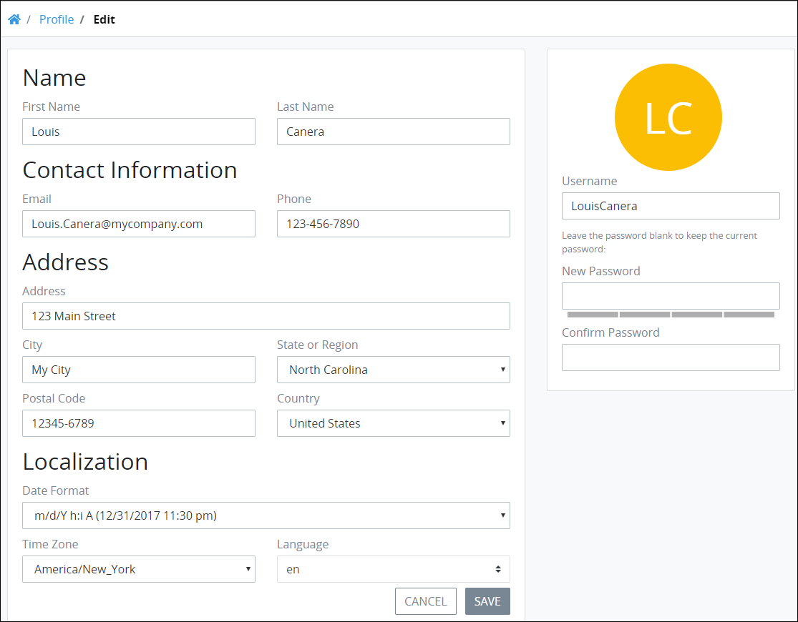

# Profile Settings

## Access Your Profile

Follow these steps to access your profile settings:

1. [Log in](log-in.md#log-in) to ProcessMaker.
2. Click your user avatar, and then select **Profile**.  

   

   The **Profile** page displays.

## Change Your Profile Settings


Passwords must adhere to the following protocol:

* Passwords must be at least eight \(8\) characters long.
* [Password special characters](https://www.owasp.org/index.php/Password_special_characters) are recommended.


Follow these steps to change your profile settings:

1. [Access your profile.](profile-settings.md#access-your-profile) The **Profile** page displays.  

   

2. The ProcessMaker Administrator may have entered some profile settings when your user account was created. Follow these guidelines to change your profile information:
   * Change the following information in the **Name** section if necessary:
     * Enter your first name in the **First Name** field.
     * Enter your last name in the **Last Name** field.
   * Change the following information in the **Contact Information** section if necessary:
     * Enter your email address in the **Email** field.
     * Enter your phone number in the **Phone** field.
   * Change the following information in the **Address** section if necessary:
     * Enter your physical address in the **Address** field.
     * Enter the city in which you work in the **City** field.
     * Select the state, region, or territory in which you work in the **State or Region** drop-down menu.
     * Enter the Postal code in which you work in the **Postal code** field.
     * Select the country where you work from the **Country** drop-down menu.
   * Change the following information in the **Localization** section if necessary:
     * Select in which time zone you work from the **Time zone** drop-down menu.
     * Select in which language to display ProcessMaker field labels from the **Language** drop-down menu.
3. Change your username in the **Username** field if necessary.
4. Follow these guidelines to change your password if necessary:
   * Enter your new password in the **New Password** field. Password validation indicates how strong your password is.
   * Confirm your new password in the **Confirm Password** field by duplicating what you entered in the **New Password** field. Password validation indicates if the **New Password** and **Confirm Password** values do not match.
5. Click **Update** to save changes to your profile. Otherwise, click **Cancel** to not make changes.

## View Another User's Profile Information

To view another user's profile information, select that person's avatar.

After that user's avatar is selected, that person's profile information displays. Each user is responsible for profile content.


Hover your mouse over a user's avatar to view that person's full name.


