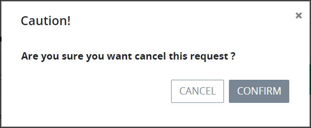
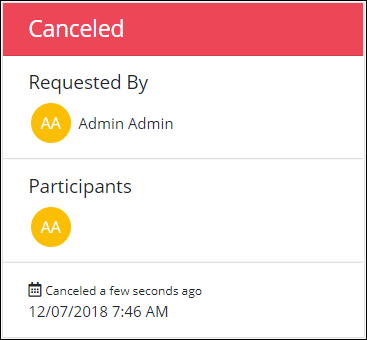
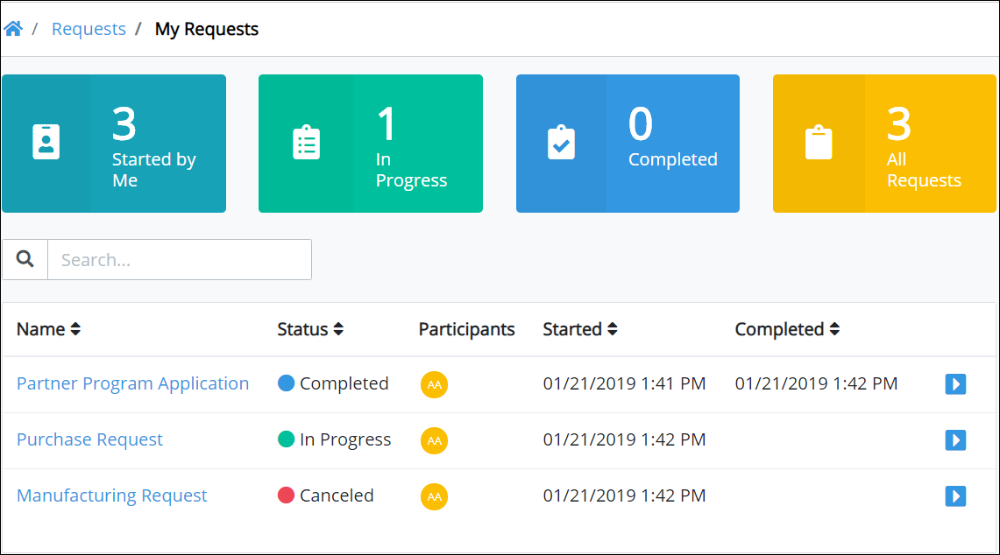

# Cancel a Request

Request participants can cancel a Request in the following circumstances:

* A Process Owner for the process associated with a Request [selects which permission\(s\) are allowed to cancel a Request for that process](../../designing-processes/viewing-processes/view-the-list-of-processes/edit-the-name-description-category-or-status-of-a-process.md#edit-general-information-about-a-process). If a Request participant's user account has that permission, then that Request participant can cancel a Request for that process.
* Any Process Administrator can cancel a Request associated with any active process.


If your user account does not have the permission\(s\) to cancel Requests for that process, functionality does not display to cancel those Requests.


## Cancel a Request

Follow these steps to cancel a Request:

1. Do one of the following:
   * [Log in](../log-in.md#log-in) to ProcessMaker. The **Started by Me** tab in the **Requests** page displays.
   * Click the **Requests** page if it is not currently displayed. The **Started by Me** tab displays.
2. Click the **In Progress** tab or click the **In Progress** iconfrom the left sidebar. The **In Progress** tab displays.  

   

3. Click the ~~Request ID value \(or Process Name associated with the Request?\)~~ in the first column of the table for the Request that you want to cancel. Information about the Request displays.  

   

4. Click the **Cancel** button. A message displays to confirm you want to cancel the Request.  

   

5. Click **Confirm**. The Request is canceled.  

   

Canceled Requests display in the **All Requests** tab.


For information how to view all Requests, see [View All Requests](view-all-requests.md).


## Related Topics







