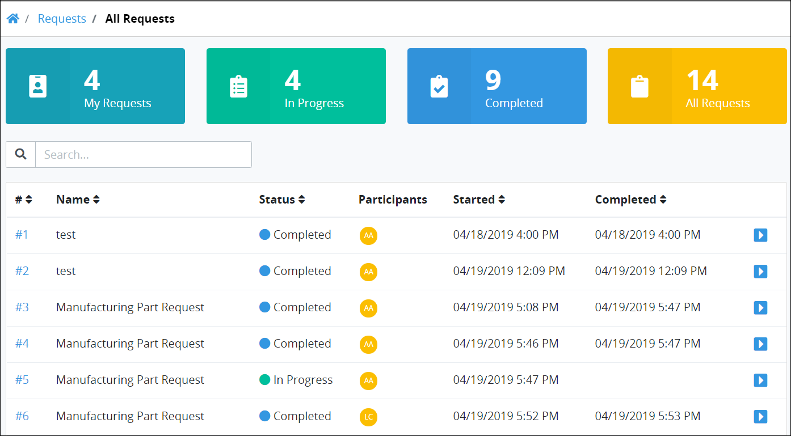

# Cancel a Request

Request participants can cancel a Request in the following circumstances:

* A Process Owner for the Process associated with a Request [selects which permission\(s\) are allowed to cancel a Request for that process](../../designing-processes/viewing-processes/view-the-list-of-processes/edit-the-name-description-category-or-status-of-a-process.md#edit-general-information-about-a-process). If a Request participant's user account has that permission, then that Request participant can cancel a Request for that Process.
* Any ProcessMaker Administrator can cancel a Request associated with any active Process.


If your user account or group membership does not have the permission\(s\) to cancel Requests for that Process, functionality does not display to cancel those Requests.


## Cancel a Request

Follow these steps to cancel a Request:

1. Do one of the following:
   * [Log in](../log-in.md#log-in) to ProcessMaker. The **My Requests** page displays.
   * Click the **Requests** page if it is not currently displayed. The **My Requests** page displays.
2. Click the **In Progress** tab or click the **In Progress** iconfrom the left sidebar. The **In Progress** page displays. ~~UPDATE THIS SCREENSHOT AFTER THE "COMPLETE" NUMBERING BUG IS FIXED.~~  

   

3. Do one of the following:

   * From the **Name** column, click the name of the Process associated with the Request that you want to cancel.
   * Click the Open Request icon  for the Request you want to cancel.

   Information about the Request displays.

   

4. Click the **Cancel** button. A message displays to confirm you want to cancel the Request.  

   

5. Click **Confirm**. The Request is canceled.  

   

Canceled Requests display in the **All Requests** page. ~~UPDATE SCREENSHOT AFTER NUMBER OF "COMPLETED" NUMBER AND THE "ALL REQUESTS" BREADCRUMBS LABEL BUGS ARE FIXED.~~


See [View All Requests](view-all-requests.md) for more information.


## Related Topics

















