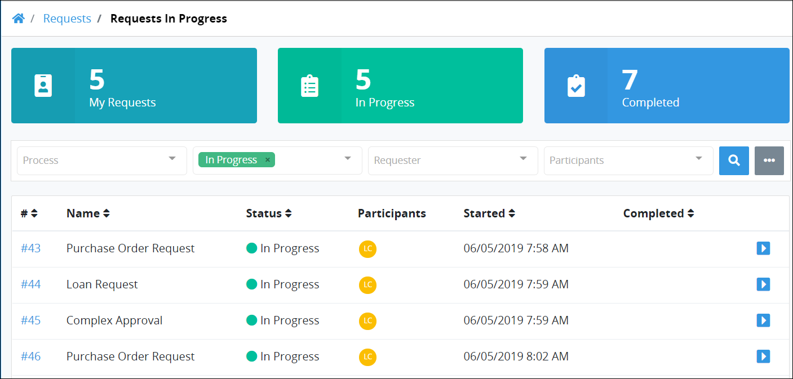
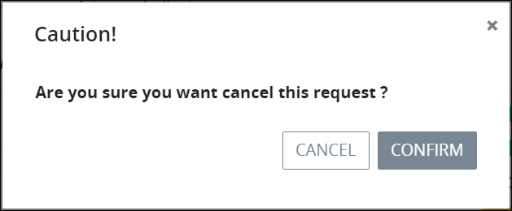

# Cancel a Request

## Overview

You can cancel a Request in the following circumstances:

* The Process associated with a Request is configured to [allow you to cancel Requests for that process](../../designing-processes/viewing-processes/view-the-list-of-processes/edit-the-name-description-category-or-status-of-a-process.md#edit-general-information-about-a-process).
* Any [ProcessMaker Administrator](../../start-here/how-to-use-this-document.md#processmaker-administrator) can cancel a Request associated with any active Process.


If a Process is not configured to allow you to cancel Requests, then functionality does not display to cancel Requests for that Process.


## Cancel a Request

Follow these steps to cancel a Request:

1. Do one of the following:
   * [Log in](../log-in.md#log-in) to ProcessMaker. The **My Requests** page displays.
   * Click the **Requests** page if it is not currently displayed. The **My Requests** page displays.
2. Click the **In Progress** tab or click the **In Progress** iconfrom the left sidebar. The **In Progress** page displays all Requests that are in progress. ~~UPDATE THIS SCREENSHOT AFTER THE "COMPLETE" NUMBERING BUG IS FIXED.~~  

   

3. Do one of the following:

   * From the **Name** column, click the name of the Process associated with the Request that you want to cancel.
   * Click the **Open Request** iconfor the Request you want to cancel.

   Information about the Request displays.

   

4. Click **Cancel**. A message displays to confirm you want to cancel the Request.  

   

5. Click **Confirm**. The Request is canceled.  

   

Canceled Requests display in the **All Requests** page. ~~UPDATE SCREENSHOT AFTER NUMBER OF "COMPLETED" NUMBER AND THE "ALL REQUESTS" BREADCRUMBS LABEL BUGS ARE FIXED.~~


See [View All Requests](view-all-requests.md) for more information.


## Related Topics

















