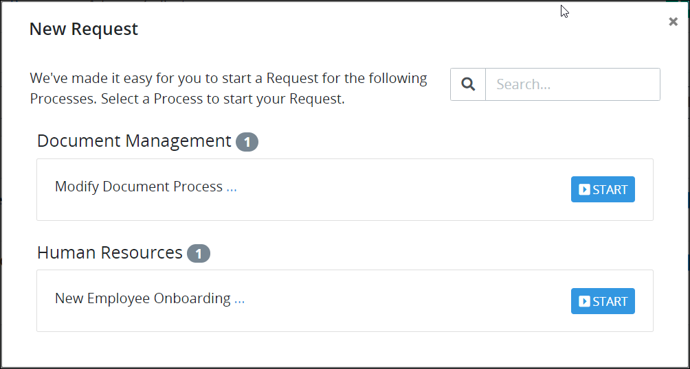

# Start a Request

## Start a Request

Follow these steps to start a Request:

1. [Log in](../log-in.md#log-in) to ProcessMaker.
2. Click **+ Request** from the top options bar, as highlighted below.  This button is always available.

   

   The **New Request** screen displays. This screen displays Processes for which you are authorized to start a new Request.

   Below is the **New Request** screen with a Process from which a Request can be started. Processes can be organized into Categories within your organization to make it easier to locate from which Process to start a Request.  

   

3. Do one of the following:

   * Select the Process for which to start a new Request.
   * From the **Search** field, enter text to filter the list of Processes, and then select the Process to start a new Request. See [Search for a Request](search-for-a-request.md) for more information.

   The Process you selected starts a Request.


If there are no active Processes or you do not have authorization to start a Request for a Process, the following message displays: **At this time there are no Requests available**.


After the Request starts, the new Request displays in the **My Requests** page.

## Related Topics

















