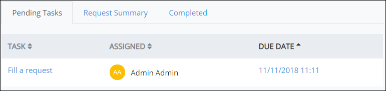
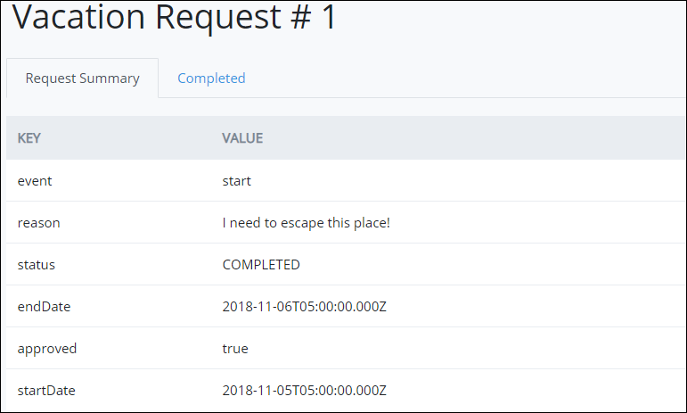
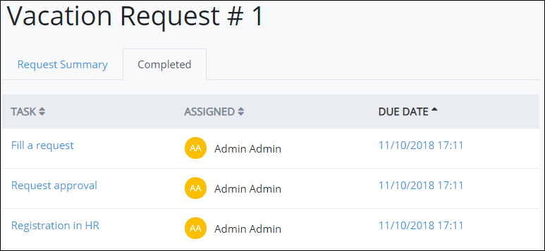
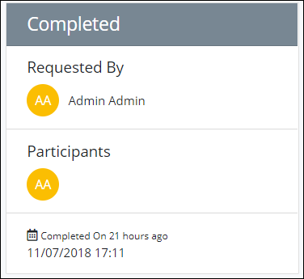

# View Request Information

A ProcessMaker Administrator can create a custom format and style for how Request information displays for your organization. This topic discusses how ProcessMaker 4 displays Request information by default.

View information about a Request by clicking the Request ID from any of the following **Request** page tabs:

* [Started By Me](view-started-requests.md) tab
* [In Progress](view-in-progress-requests.md) tab
* [Completed](view-completed-requests.md) tab
* [All Requests](view-all-requests.md) tab

## Information for In-Progress Requests

This section discusses how information displays for in-progress Requests.

### Pending Tasks

The **Pending Tasks** tab displays summary information for all upcoming tasks in the Request.

The **Pending Tasks** tab displays the following information:

* **Task:** The **Task** column displays the name of the pending task. If a pending task is assigned to you, a hyperlink displays in the task name.
* **Assigned:** The **Assigned** column displays the avatar for the username to whom the task is assigned.
* **Due Date:** The **Due Date** column displays the date the task is due.


[Control how tabular information displays.](../control-how-requests-display-in-a-tab.md)


### Request Participants

In-progress Requests display information about the participants in a selected Request.

The following information displays about participants in a selected in-progress Request:

* **Requested By:** The **Requested By** field displays the avatar and full name of the person who started the selected Request. The Request may have been started from a person manually interacting with a form or as an authenticated user to the ProcessMaker 4 REST API.
* **Participants:** The **Participants** field displays the avatars of all participants in the selected Request to date.
* **Request creation date:** The date and time the Request was created displays below the **Participants** field.

## Information for Completed Requests

This section discusses how information displays for completed Requests.

### Request Summary

The **Request Summary** tab displays a summary of all information entered into the completed Request. Request information may be entered in the following ways:

* Users manually enter information into forms.
* Authenticated users submit data through the ProcessMaker 4 REST API.

The **Request Summary** tab displays the following information:

* **KEY:** The **KEY** column displays the key name as entered into a screen form at design-time or specified through the ProcessMaker 4 REST API.
* **VALUE:** The **VALUE** column displays the key value as entered by a person manually interacting with a form or specified through the ProcessMaker 4 REST API.


[Control how tabular information displays.](../control-how-requests-display-in-a-tab.md)


### Summary of Tasks for the Completed Request

The **Completed** tab displays a summary of all tasks for the selected completed Request.

The **Completed** tab displays the following information:

* **Task:** The **Task** column displays the name of each completed task in the selected Request. 
* Assigned: The **Assigned** column displays the avatar for the username to whom the task was assigned.
* **Due Date:** The **Due Date** column displays the date the task is due.


[Control how tabular information displays.](../control-how-requests-display-in-a-tab.md)


### Request Participants

Completed Requests display information about the participants in a selected Request.

The following information displays about participants in a selected completed Request:

* **Requested By:** The **Requested By** field displays the avatar and full name of the person who started the selected Request. The Request may have been started from a person manually interacting with a form or as an authenticated user to the ProcessMaker 4 REST API.
* **Participants:** The **Participants** field displays the avatars of all participants in the selected Request.
* **Request completion date:** The date and time the Request was completed displays below the **Participants** field.

## Related Topics











