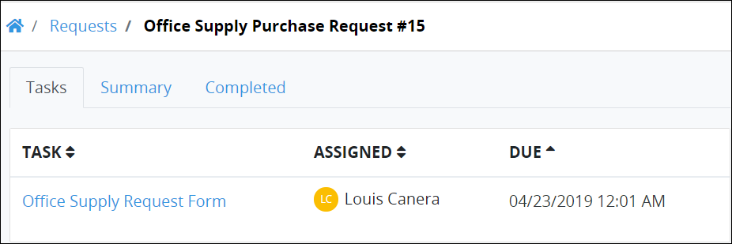
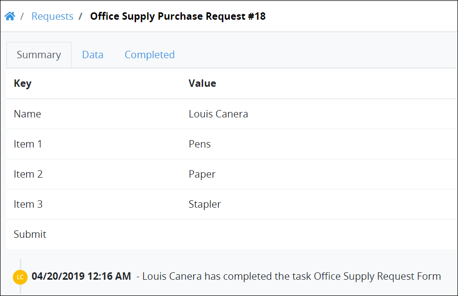
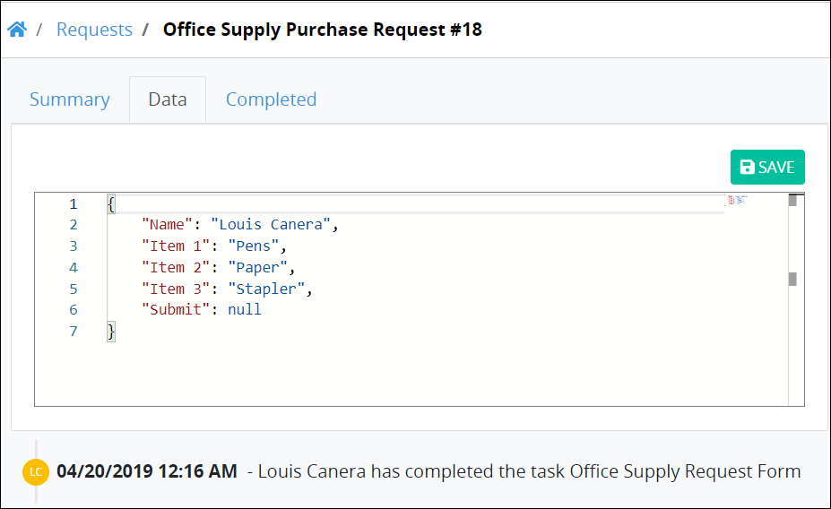
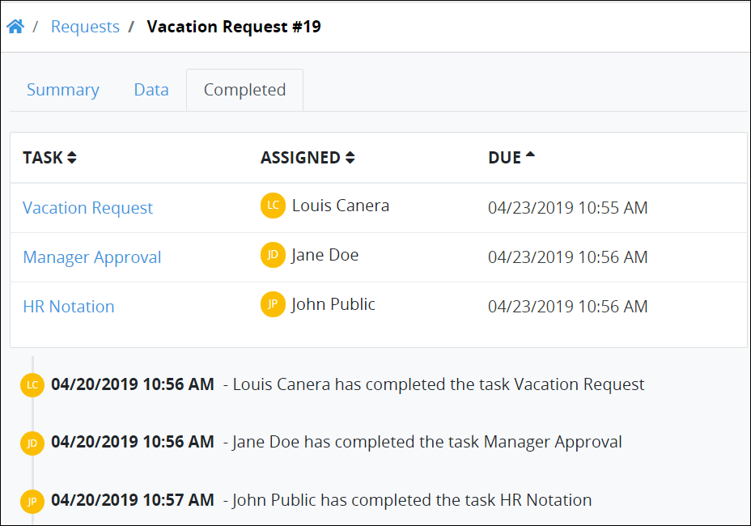
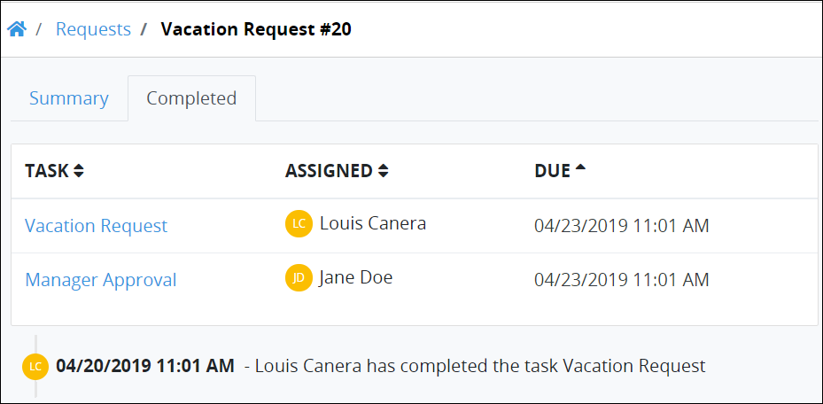
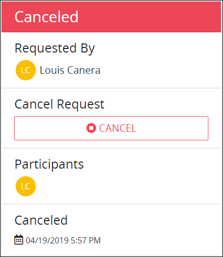

# View a Request Summary

## Overview

~~A ProcessMaker Administrator can create a custom format and style for how the Request summary displays for your organization.~~ This topic discusses how ProcessMaker 4 displays the Request summary ~~by default~~.

Follow these steps to view a Request summary:

1. View any of the following Request pages:
   * [My Requests](view-started-requests.md#view-requests-you-started)
   * [Requests in Progress](view-in-progress-requests.md#view-in-progress-requests-in-which-you-are-a-participant)
   * [Completed Requests](view-completed-requests.md#view-completed-requests-in-which-you-are-a-participant)
   * [All Requests](view-all-requests.md#view-all-requests-in-your-organization) \(Note that your ProcessMaker user account or group must have the permission to view this page.\)
2. Do one of the following:
   * From the **Name** column in the Request page, click the Process name associated with the Request that you want to view.
   * Click the **Open Request** iconfor the Request that you want to view its summary.

## Summary for In-Progress Requests

This section discusses how the summary displays for in-progress Requests.

### Assigned Participant Tasks

The **Tasks** tab displays the summary for all assigned Tasks to Request participants to that time.

The **Tasks** tab displays the following summary in tabular format about assigned Tasks to Request participants to that time:

* **Task:** The **Task** column displays the name of each Task to be completed for the selected Request for all Request participants. If a Task is assigned to you, a hyperlink displays in the Task name.
* **Assigned:** The **Assigned** column displays the username's avatar to whom the Task is assigned. Hover your cursor over a user's avatar to view that person's full name.
* **Due:** The **Due** column displays the date the Task is due. The time zone setting to display the time is according to the ProcessMaker 4 server unless your [user profile's](../profile-settings.md#change-your-profile-settings) **Time zone** setting is specified.

Below the table, the history of the Request displays all Request actions. [See Request History](request-details.md#request-history).


### No Assigned Tasks?

If there are no assigned Tasks for the selected Request, the following message displays: **No Data Available**.

### Display Information the Way You Want It

[Control how tabular information displays](../control-how-requests-display-in-a-tab.md), including how to sort columns or how many items display per page.


### Values in the Request

The **Summary** tab displays the summary of information entered into the Request when a Request completes. However, because the Request is in progress, there are no Request values to display. The Summary tab displays the following message: **This Request is currently in progress. This screen will be populated once the Request is completed**.

### Completed Tasks Summary

The **Completed** tab displays the summary of all Tasks Request participants completed to that time. ~~Verify this is accurate.~~

~~ADD SCREEN SHOT~~

The **Completed** tab displays the following summary in tabular format about completed Tasks Request participants completed to that time:

* **Task:** The **Task** column displays the name of each completed Task in the selected Request. 
* **Assigned:** The **Assigned** column displays the username's avatar to whom the Task was assigned. Hover your cursor over a user's avatar to view that person's full name.
* **Due:** The **Due** column displays the date the Task was due. The time zone setting to display the time is according to the ProcessMaker 4 server unless your [user profile's](../profile-settings.md#change-your-profile-settings) **Time zone** setting is specified.

Below the table, the history of the Request displays all Request actions. [See Request History](request-details.md#request-history).


### There Are No Completed Tasks?

If the selected Request has no completed Tasks, the following message displays: **No Data Available**.

### Display Information the Way You Want It

[Control how tabular information displays](../control-how-requests-display-in-a-tab.md), including how to sort columns or how many items display per page.


### Request Participants

Each in-progress Request displays a summary of the Request participants to that time.

The following summary displays about participants in an in-progress Request:

* **Requested By:** The **Requested By** field displays the avatar and full name of the person who started the selected Request. Hover your cursor over a user's avatar to view that person's full name.
* **Cancel Request:** The **Cancel Request** field allows a Request participant or ProcessMaker Administrator to cancel the Request if that Request participant's user account has the appropriate permission to cancel Requests for that Process. If your user account does not have the permission\(s\) to cancel Requests for that Process, the **Cancel Request** field does not display. See [Cancel a Request](delete-a-request.md) for more information.
* **Participants:** The **Participants** field displays each Request participant's avatar in the selected Request to that time. Hover your cursor over a user's avatar to view that person's full name.
* **Request creation date:** The date and time the Request was created displays below the **Participants** field. The time zone setting to display the time is according to the ProcessMaker 4 server unless your [user profile's](../profile-settings.md#change-your-profile-settings) **Time zone** setting is specified.

## Summary for Completed Requests

This section discusses how the summary displays for completed Requests.

### Values in the Request

The **Summary** tab displays the summary of information entered into the completed Request. Request information may be entered in the following ways:

* Request participants manually enter information into ProcessMaker Screens. ProcessMaker Screens are digital forms.
* Authenticated users submit data through the [ProcessMaker 4 REST API](https://develop-demo.bpm4.qa.processmaker.net/api/documentation).

~~Process Owners can specify how information displays in the **Summary** tab. By default,~~ the **Summary** tab displays the JSON-formatted key/value pairs in tabular format that represent ProcessMaker Screen control data. Information is displayed:

* **KEY:** The **KEY** column displays the JSON key name that represents the ProcessMaker Screen control name the Request participant entered data or specified through the [ProcessMaker 4 REST API](https://develop-demo.bpm4.qa.processmaker.net/api/documentation). For example, a Text control to enter your name could be named `Full Name` which would display in the **Key** column here.
* **VALUE:** The **VALUE** column displays that key's value as entered by a person manually interacting with a form or specified through the [ProcessMaker 4 REST API](https://develop-demo.bpm4.qa.processmaker.net/api/documentation). For example, a Text control to enter your name could have the value `John Doe` which would display in the **Value** column here.

Below the table, the history of the Request displays all Request actions. [See Request History](request-details.md#request-history).


### Summary Tab Displays Information for Completed Requests

The **Summary** tab only displays information for completed Requests. If you select the **Summary** tab for an in-progress Request, the following message displays: **Request In Progress: This Request is currently in progress. This screen will be populated once the Request is completed.**

### Display Information the Way You Want It

[Control how tabular information displays](../control-how-requests-display-in-a-tab.md), including how to sort columns or how many items display per page.


### Editable Request Data


Your user account or group membership must have the "Requests: Edit Request Data" permission to edit Request data.

See the [Request permissions](../../processmaker-administration/permission-descriptions-for-users-and-groups.md#requests) or ask your ProcessMaker Administrator for assistance.


The **Data** tab displays the data from a completed Request in JSON format. The **Data** column only displays when that Request is completed.

Follow these steps to edit and save the completed Request data from those values that were submitted in the Request:

1. View the **Data** tab. Note that the **Data** tab does not display until the Request is completed.
2. From the editable JSON field, change the values that were submitted during the Request to those that you want.
3. Click **Save**. The following message displays when the Request values are changed: **Request data successfully updated**.

Below the editable JSON field, the history of the Request displays all Request actions. [See Request History](request-details.md#request-history).

### Completed Tasks Summary

The **Completed** tab displays the summary of all assigned Tasks to Request participants for the selected completed Request.

The **Completed** tab displays the following summary in tabular format about assigned Tasks to Request participants for the completed Requests:

* **Task:** The **Task** column displays the name of each completed Task in the selected Request. 
* **Assigned:** The **Assigned** column displays the username's avatar to whom the Task was assigned. Hover your cursor over a user's avatar to view that person's full name.
* **Due:** The **Due** column displays the date the Task was due. The time zone setting to display the time is according to the ProcessMaker 4 server unless your [user profile's](../profile-settings.md#change-your-profile-settings) **Time zone** setting is specified.

Below the table, the history of the Request displays all Request actions. [See Request History](request-details.md#request-history).


### Not a Completed Request?

If the selected Request is not completed, the following message displays: **No Data Available**.

### Display Information the Way You Want It

[Control how tabular information displays](../control-how-requests-display-in-a-tab.md), including how to sort columns or how many items display per page.


### Request Participants

Each completed Request displays a summary of the Request participants.

The following summary displays about participants in a completed Request:

* **Requested By:** The **Requested By** field displays the avatar and full name of the person who started the selected Request. Hover your cursor over a user's avatar to view that person's full name.
* **Participants:** The **Participants** field displays each Request participant's avatar in the selected Request. Hover your cursor over a user's avatar to view that person's full name.
* **Request completion date:** The date and time the Request was completed displays below the **Participants** field. The time zone setting to display the time is according to the ProcessMaker 4 server unless your [user profile's](../profile-settings.md#change-your-profile-settings) **Time zone** setting is specified.

## Summary for Canceled Requests

This section discusses how the summary displays for canceled Requests.

### Values in the Request

The **Summary** tab displays the summary of information entered into the Request to the time of its cancellation. Request information may be entered in the following ways:

* Request participants manually enter information into ProcessMaker Screens. ProcessMaker Screens are digital forms.
* Authenticated users submit data through the [ProcessMaker 4 REST API](https://develop-demo.bpm4.qa.processmaker.net/api/documentation).

~~Process Owners can specify how information displays in the **Summary** tab. By default,~~ the **Summary** tab displays the JSON-formatted key/value pairs in tabular format that represent ProcessMaker Screen control data. Information is displayed:

* **KEY:** The **KEY** column displays the JSON key name that represents the ProcessMaker Screen control name the Request participant entered data or specified through the [ProcessMaker 4 REST API](https://develop-demo.bpm4.qa.processmaker.net/api/documentation). For example, a Text control to enter your name could be named `Full Name` which would display in the **Key** column here.
* **VALUE:** The **VALUE** column displays that key's value as entered by a person manually interacting with a form or specified through the [ProcessMaker 4 REST API](https://develop-demo.bpm4.qa.processmaker.net/api/documentation). For example, a Text control to enter your name could have the value `John Doe` which would display in the **Value** column here.

Below the table, the history of the Request displays all Request actions. [See Request History](request-details.md#request-history).


[Control how tabular information displays](../control-how-requests-display-in-a-tab.md), including how to sort columns or how many items display per page.


### Completed Tasks Summary

The **Completed** tab displays the summary of all Tasks Request participants completed to the time the selected Request was canceled.

The **Completed** tab displays the following summary in tabular format about completed Tasks Request participants completed to the time the Request was canceled:

* **Task:** The **Task** column displays the name of each completed Task in the selected Request. 
* **Assigned:** The **Assigned** column displays the username's avatar to whom the Task was assigned. Hover your cursor over a user's avatar to view that person's full name.
* **Due:** The **Due** column displays the date the Task was due. The time zone setting to display the time is according to the ProcessMaker 4 server unless your [user profile's](../profile-settings.md#change-your-profile-settings) **Time zone** setting is specified.

Below the table, the history of the Request displays all Request actions. [See Request History](request-details.md#request-history).


### There Are No Completed Tasks?

If the selected Request has no completed Tasks, the following message displays: **No Data Available**.

### Display Information the Way You Want It

[Control how tabular information displays](../control-how-requests-display-in-a-tab.md), including how to sort columns or how many items display per page.


### Request Participants

Each canceled Request displays a summary of the Request participants to the time the Request was canceled.

The following summary displays about participants in a canceled Request:

* **Requested By:** The **Requested By** field displays the avatar and full name of the person who started the selected Request. Hover your cursor over a user's avatar to view that person's full name.
* **Participants:** The **Participants** field displays each Request participant's avatar in the selected Request to the time the Request was canceled. Hover your cursor over a user's avatar to view that person's full name.
* **Request completion date:** ~~The date and time the Request was completed displays below the **Participants** field. The time zone setting to display the time is according to the ProcessMaker 4 server unless your~~ [~~user profile's~~](../profile-settings.md#change-your-profile-settings) ~~**Time zone** setting is specified. THIS IS A BUG, ISN'T IT?~~

## Error Summary for Requests

### Summary of the Error

The **Errors** tab displays the summary about an error for a selected Request if an error occurred. If a Request error has not occurred, the **Errors** tab does not display.

The **Errors** tab displays the following summary in tabular format about Request errors:

* **Error:** The **Error** column displays the error description. 
* **Time:** The **Time** column displays how long ago the error occurred.
* **Element:** The **Element** column displays to which element the error occurred within the Process associated with the Request.

Below the table, the history of the Request displays all Request actions. [See Request History](request-details.md#request-history).

### Assigned Participant Tasks

The **Tasks** tab displays the summary for all assigned Tasks to Request participants to the time the error occurred.

~~NEED SCREEN SHOT OF TASK TAB WITH AN ERROR~~

The **Tasks** tab displays the following summary in tabular format about assigned Tasks to Request participants to the time the error occurred:

* **Task:** The **Task** column displays the name of each Task to be completed for the selected Request for all Request participants. If a Task is assigned to you, a hyperlink displays in the Task name.
* **Assigned:** The **Assigned** column displays the username's avatar to whom the Task is assigned. Hover your cursor over a user's avatar to view that person's full name.
* **Due:** The **Due** column displays the date the Task is due. The time zone setting to display the time is according to the ProcessMaker 4 server unless your [user profile's](../profile-settings.md#change-your-profile-settings) **Time zone** setting is specified.

Below the table, the history of the Request displays all Request actions. [See Request History](request-details.md#request-history).


### No Assigned Tasks?

If there are no assigned Tasks for the selected Request, the following message displays: **No Data Available**.

### Display Information the Way You Want It

[Control how tabular information displays](../control-how-requests-display-in-a-tab.md), including how to sort columns or how many items display per page.


### Values in the Request

The **Summary** tab displays the summary of information entered into the Request to the time the error occurred. Request information may be entered in the following ways:

* Request participants manually enter information into ProcessMaker Screens. ProcessMaker Screens are digital forms.
* Authenticated users submit data through the [ProcessMaker 4 REST API](https://develop-demo.bpm4.qa.processmaker.net/api/documentation).

~~NEED SCREEN SHOT OF SUMMARY TAB WITH AN ERROR~~

~~Process Owners can specify how information displays in the **Summary** tab. By default,~~ the **Summary** tab displays the JSON-formatted key/value pairs in tabular format that represent ProcessMaker Screen control data. Information is displayed:

* **KEY:** The **KEY** column displays the JSON key name that represents the ProcessMaker Screen control name the Request participant entered data or specified through the [ProcessMaker 4 REST API](https://develop-demo.bpm4.qa.processmaker.net/api/documentation). For example, a Text control to enter your name could be named `Full Name` which would display in the **Key** column here.
* **VALUE:** The **VALUE** column displays that key's value as entered by a person manually interacting with a form or specified through the [ProcessMaker 4 REST API](https://develop-demo.bpm4.qa.processmaker.net/api/documentation). For example, a Text control to enter your name could have the value `John Doe` which would display in the **Value** column here.

Below the table, the history of the Request displays all Request actions. [See Request History](request-details.md#request-history).


[Control how tabular information displays](../control-how-requests-display-in-a-tab.md), including how to sort columns or how many items display per page.


### Completed Tasks Summary

The **Completed** tab displays the summary of all Tasks Request participants completed to the time the Request error occurred.

~~NEED SCREEN SHOT OF COMPLETED TAB WITH AN ERROR~~

The **Completed** tab displays the following summary in tabular format about completed Tasks Request participants completed to the time the Request error occurred:

* **Task:** The **Task** column displays the name of each completed Task in the selected Request. 
* **Assigned:** The **Assigned** column displays the username's avatar to whom the Task was assigned. Hover your cursor over a user's avatar to view that person's full name.
* **Due:** The **Due** column displays the date the Task was due. The time zone setting to display the time is according to the ProcessMaker 4 server unless your [user profile's](../profile-settings.md#change-your-profile-settings) **Time zone** setting is specified.

Below the table, the history of the Request displays all Request actions. [See Request History](request-details.md#request-history).


### There Are No Completed Tasks?

If the selected Request has no completed Tasks, the following message displays: **No Data Available**.

### Display Information the Way You Want It

[Control how tabular information displays](../control-how-requests-display-in-a-tab.md), including how to sort columns or how many items display per page.


### Request Participants

Each Request that has an error displays a summary of the Request participants to the time of the error.

The following summary displays about participants in a Request in which an error occurred:

* **Requested By:** The **Requested By** field displays the avatar and full name of the person who started the selected Request. Hover your cursor over a user's avatar to view that person's full name.
* **Participants:** The **Participants** displays each Request participant's avatar in the selected Request to the time of the error. Hover your cursor over a user's avatar to view that person's full name.
* **Request error date:** The date and time in which the Request error occurred displays below the **Participants** field. The time zone setting to display the time is according to the ProcessMaker 4 server unless your [user profile's](../profile-settings.md#change-your-profile-settings) **Time zone** setting is specified.

## Request History

Below the **Error**/**Task**/**Summary**/**Data**/**Completed** tables, the history of the Request displays all Request actions to that time: what each Request participant and ProcessMaker Script performed for this Request. The oldest Request actions display at the top of the Request history.

The following information displays about each event in the Request history:

* **Request participant:** The Request participant who performed the action is represented by his or her avatar. Hover your cursor over a user's avatar to view that person's full name. If the ProcessMaker system performed an action by running a ProcessMaker Script or other automatic function, that action is represented by "S" avatar.
* **Date and time the action occurred:** To the right of the Request participant displays the date and time the Request action occurred. The time zone setting to display the time is according to the ProcessMaker 4 server unless your [user profile's](../profile-settings.md#change-your-profile-settings) **Time zone** setting is specified.
* **Description of the action:** To the right of when the Request action occurred displays a description of that action. The ProcessMaker system generates this action description.

## Related Topics

















