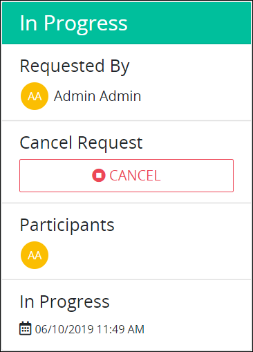
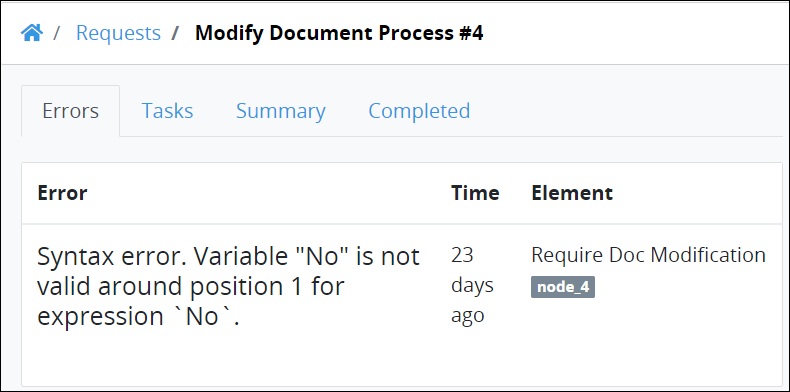

# View Request Information

A ProcessMaker Administrator can create a custom format and style for how Request information displays for your organization. This topic discusses how ProcessMaker 4 displays Request information by default.

To view information about a Request, do one of the following:

* From the **Name** column, click the name of the process associated with the Request that you want to view.
* Click the Open Request iconfor the Request in which you want to view information.

## Information for In-Progress Requests

This section discusses how information displays for in-progress Requests.

### Tasks

The **Tasks** tab displays summary information for all upcoming tasks in the Request.

The **Tasks** tab displays the following information:

* **Task:** The **Task** column displays the name of the pending task. If a pending task is assigned to you, a hyperlink displays in the task name.
* **Assigned:** The **Assigned** column displays the avatar for the username to whom the task is assigned.
* **Due Date:** The **Due Date** column displays the date the task is due.


If there are no tasks in which you have started or participated in, the following message displays: **No Data Available**.



[Control how tabular information displays.](../control-how-requests-display-in-a-tab.md)


### Request Participants

In-progress Requests display information about the participants in a selected Request.

The following information displays about participants in a selected in-progress Request:

* **Requested By:** The **Requested By** field displays the avatar and full name of the person who started the selected Request. The Request may have been started from a person manually interacting with a form or as an authenticated user to the ProcessMaker 4 [REST API](https://develop.bpm4.qa.processmaker.net/api/documentation).
* **Cancel Request:** The **Cancel Request** field allows a Request participant or ProcessMaker Administrator to cancel the Request if that Request participant's user account has the appropriate permission to cancel Requests for that process. If your user account does not have the permission\(s\) to cancel Requests for that process, the **Cancel Request** field does not display.
* **Participants:** The **Participants** field displays the avatars of all participants in the selected Request to date.
* **Request creation date:** The date and time the Request was created displays below the **Participants** field.

## Information for Completed Requests

This section discusses how information displays for completed Requests.

### Request Summary

The **Request Summary** tab displays a summary of all information entered into the completed Request. Request information may be entered in the following ways:

* Users manually enter information into forms.
* Authenticated users submit data through the ProcessMaker 4 [REST API](https://develop.bpm4.qa.processmaker.net/api/documentation).

The **Request Summary** tab displays the following information:

* **KEY:** The **KEY** column displays the key name as entered into a screen form at design-time or specified through the ProcessMaker 4 [REST API](https://develop.bpm4.qa.processmaker.net/api/documentation).
* **VALUE:** The **VALUE** column displays the key value as entered by a person manually interacting with a form or specified through the ProcessMaker 4 [REST API](https://develop.bpm4.qa.processmaker.net/api/documentation).


[Control how tabular information displays.](../control-how-requests-display-in-a-tab.md)


### Summary of Tasks for the Completed Request

The **Completed** tab displays a summary of all tasks for the selected completed Request.

The **Completed** tab displays the following information:

* **Task:** The **Task** column displays the name of each completed task in the selected Request. 
* **Assigned:** The **Assigned** column displays the avatar for the username to whom the task was assigned.
* **Due Date:** The **Due Date** column displays the date the task is due.


[Control how tabular information displays.](../control-how-requests-display-in-a-tab.md)


### Request Participants

Completed Requests display information about the participants for a selected Request.

The following information displays about participants in a selected completed Request:

* **Requested By:** The **Requested By** field displays the avatar and full name of the person who started the selected Request. The Request may have been started from a person manually interacting with a form or as an authenticated user to the ProcessMaker 4 [REST API](https://develop.bpm4.qa.processmaker.net/api/documentation).
* **Participants:** The **Participants** field displays the avatars of all participants in the selected Request.
* **Request completion date:** The date and time the Request was completed displays below the **Participants** field.

## Error Information for a Request

### Summary of the Error

The **Errors** tab displays summary information about an error for a selected Request if an error occurred. If a Request error has not occurred, the **Errors** tab does not display.

The **Errors** tab displays the following information:

* **Error:** The **Error** column displays the error description. 
* **Time:** The **Time** column displays how long ago the error occurred.
* **Element:** The **Element** column displays to which element the error occurred within the process associated with the Request.

### Request Participants

Requests in which an error occurs display information about the participants for that Request.

The following information displays about participants in a selected Request in which an error occurred:

* **Requested By:** The **Requested By** field displays the avatar and full name of the person who started the selected Request. The Request may have been started from a person manually interacting with a form or as an authenticated user to the ProcessMaker 4 [REST API](https://develop.bpm4.qa.processmaker.net/api/documentation).
* **Participants:** The **Participants** field displays the avatars of all participants in the selected Request.
* **Request error date:** The date and time in which the Request error occurred displays below the **Participants** field.

## Related Topics

















