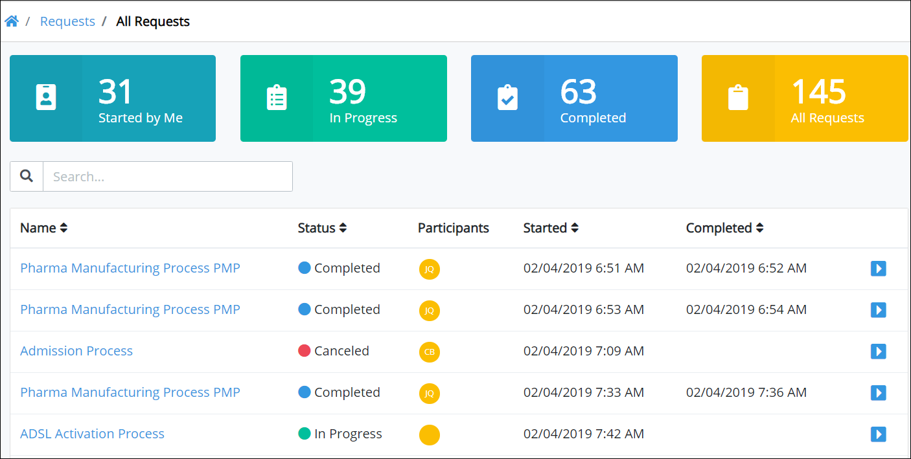

# View All Requests

The **All Requests** tab in the **Requests** page displays all Requests that you started or in which you are a participant. Request information display in tabular format.

## View All Requests You Started or in Which You Are a Participant

Follow these steps to view all Requests you started or in which you are a participant:

1. Do one of the following:
   * [Log in](../log-in.md#log-in) to ProcessMaker. The **Started by Me** tab in the **Requests** page displays.
   * Click the **Requests** option from the top menu if it is not currently displayed. The **Started by Me** tab displays.
2. Click the **All Requests** tab or click the **All** iconfrom the left sidebar.


Click the Request ID value in the first column of the table to [view information](request-details.md) about that Request.



Use the [Search](search-for-a-request.md) field to filter Requests that display in this tab.


The **All Requests** tab displays the following information:

* **ID:** The **ID** column displays the Request ID. ~~What does the ID represent?~~ Click the ID to [view information](request-details.md) about that Request.
* **Process:** The **Process** column displays the name of the process associated with the Request.
* **Status:** The **Status** column displays the status of the process associated with the Request. The following are possible statuses:
  * In Progress
  * Completed
* **Participants:** The **Participants** column displays avatars of each participant in the Request.
* **Started:** The **Started** column displays the date and time you made the Request. The time is displayed according to your time zone setting.
* **Completed:** The **Completed** column displays the date and time the Request was completed. If the Request is not completed, this field displays no value for that Request. The time is displayed according to your time zone setting.


If there are no Requests in which you have started or participated in, the following message displays: **No Data Available**.



[Control how Request information displays.](../control-how-requests-display-in-a-tab.md)


## Related Topics















