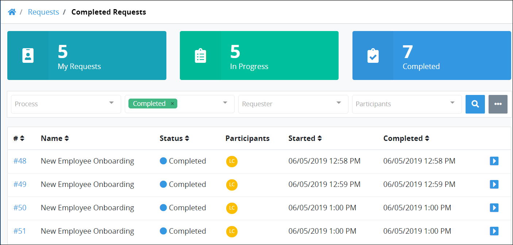

# View Completed Requests

The **Completed** page displays all Requests that have completed in which you participated. Request information display in tabular format.

## View Completed Requests in Which You Are a Participant

Follow these steps to view completed Requests: ~~UPDATE SCREENSHOT AFTER "COMPLETED" COUNT INDICATOR BUG IS FIXED~~

1. Do one of the following:
   * [Log in](../log-in.md#log-in) to ProcessMaker. The **My Requests** page displays.
   * Click the **Requests** option from the top menu if it is not currently displayed. The **My Requests** page displays.
2. Click the **Completed** tab or click the **Completed** iconfrom the left sidebar. The **Completed** page displays. ~~UPDATE THE SCREENSHOT AFTER THE "COMPLETED" NUMBER BUG IS FIXED.~~

The **Completed** page displays the following information in tabular format:

* **Name:** The **Name** column displays the name of the Process associated with the Request. Click the Process name to [view information](request-details.md#information-for-completed-requests) about that Request.
* **Status:** The **Status** column displays the **Completed** status.
* **Participants:** The **Participants** column displays avatars of each participant in the Request.
* **Started:** The **Started** column displays the date and time you made the Request. The time zone setting to display the time is according to the ProcessMaker 4 server unless your [user profile's](../profile-settings.md#change-your-profile-settings) **Time zone** setting is specified.
* **Completed:** The **Completed** column displays the date and time the Request was completed. The time zone setting to display the time is according to the ProcessMaker 4 server unless your [user profile's](../profile-settings.md#change-your-profile-settings) **Time zone** setting is specified.


### View Information About A Request

To [view information](request-details.md) about a Request, do one of the following:

* From the **Name** column, click the Process name associated with the Request that you want to view.
* Click the **Open Request** iconfor the Request in which you want to view information.

### Search for a Request

Use the [Search](search-for-a-request.md) field to filter Requests that display in this tab.

### No Requests?

If there are no Requests in this tab, the following message displays: **No Data Available**.

### Display Information the Way You Want It

[Control how tabular information displays](../control-how-requests-display-in-a-tab.md), including how to sort columns or how many items display per page.


## Related Topics

















