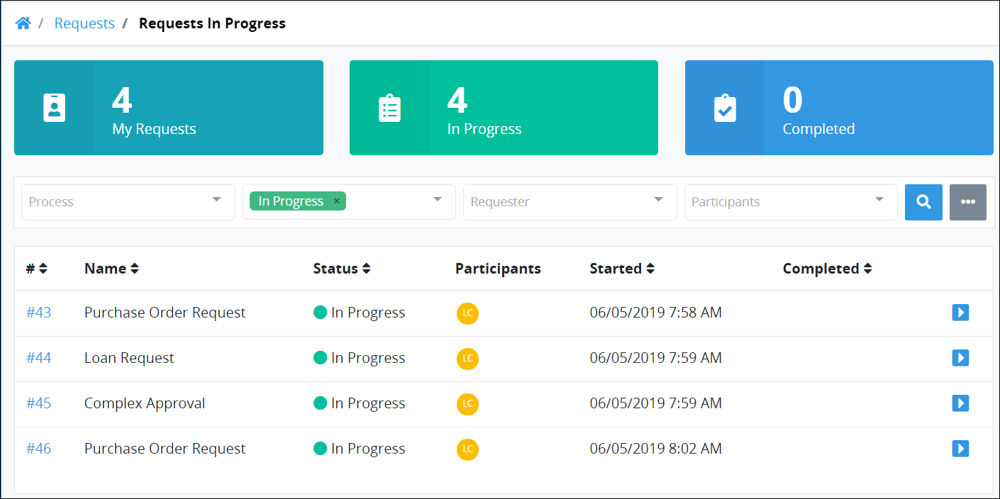

# View Requests That Are In Progress

The **In Progress** tab in the **Requests** page displays all in-progress Requests in which you are participating. Request information display in tabular format.

## View In-Progress Requests in Which You are a Participant

Follow these steps to view in-progress Requests:

1. Do one of the following:
   * [Log in](../log-in.md#log-in) to ProcessMaker. The **Started by Me** tab in the **Requests** page displays.
   * Click the **Requests** option from the top menu if it is not currently displayed. The **Started by Me** tab displays.
2. Click the **In Progress** tab or click the **In Progress** iconfrom the left sidebar.


Click the Request ID value in the first column of the table to [view information](request-details.md) about that Request.



Use the [Search](search-for-a-request.md) field to filter Requests that display in this tab.


The **In Progress** tab displays the following information:

* **ID:** The **ID** column displays the Request ID. ~~What does the ID represent?~~ Click the ID to [view information](request-details.md) about that Request.
* **Process:** The **Process** column displays the name of the process associated with the Request.
* **Status:** The **Status** column displays the **In Progress** status.
* **Participants:** The **Participants** column displays avatars of each participant in the Request. Participants might be users interacting with a form or as an authenticated user to the ProcessMaker 4 REST API.
* **Started:** The **Started** column displays the date and time you made the Request. The time is displayed according to your time zone setting.
* **Completed:** The **Completed** column displays the date and time the Request was completed. Since Requests in this tab are in-progress, this column is empty.


If there are no Requests in progress in which you are a participant, the following message displays: **No Data Available**.



[Control how Request information displays.](../control-how-requests-display-in-a-tab.md)


## Related Topics







