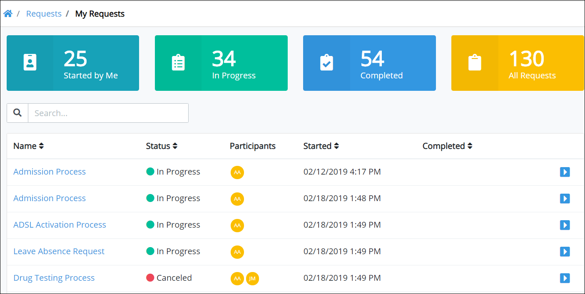

# View Requests You Started

The **Started by Me** tab in the **Requests** page displays all Requests you started. Request information displays in tabular format.

## View Requests You Started

Do one of the following to view Requests that you started:

* [Log in](../log-in.md#log-in) to ProcessMaker. The **Started by Me** tab in the **Requests** page displays.
* Click the **Requests** option from the top menu if it is not currently displayed. The **Started by Me** tab displays.


To [view information](request-details.md) about a Request, do one of the following:

* From the **Name** column, click the name of the process associated with the Request that you want to view.
* Click the Open Request icon  for the Request in which you want to view information.



Use the [Search](search-for-a-request.md) field to filter Requests that display in this tab.


The **Started by Me** tab displays the following information:

* **Name:** The **Name** column displays the name of the process associated with the Request. Click the process name to [view information](request-details.md) about that Request.
* **Status:** The **Status** column displays the status of the process associated with the Request. The following are possible statuses:
  * **In Progress:** The Request is in-progress.
  * **Completed:** The Request is completed.
  * **Error:** An error occurred with the Request. [View the Request](request-details.md) to see the error.
* **Participants:** The **Participants** column displays avatars of each participant in the Request.
* **Started:** The **Started** column displays the date and time you made the Request. The time is displayed according to your time zone setting.
* **Completed:** The **Completed** column displays the date and time the Request was completed. If the Request is not completed, this field displays no value for that Request. The time is displayed according to your time zone setting.


If there are no Requests you have started, the following message displays: **No Data Available**.



[Control how tabular information displays.](../control-how-requests-display-in-a-tab.md)


## Related Topics

















