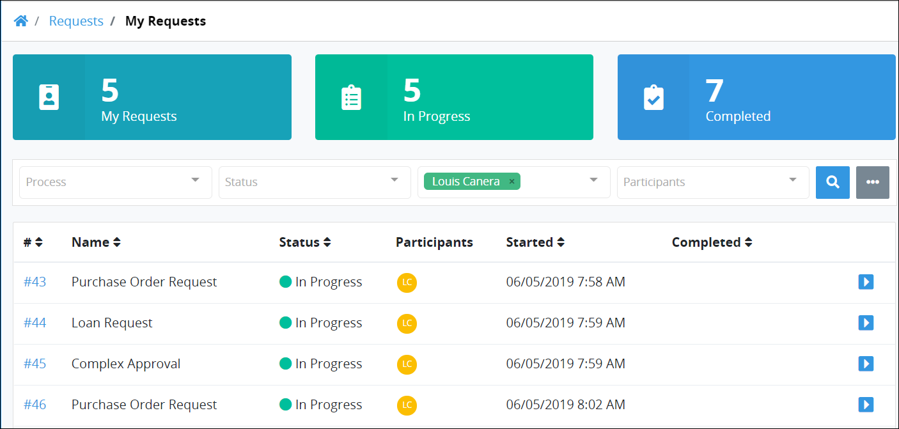

# View Requests You Started

The **Started by Me** tab in the **Requests** page displays all Requests you started. Request information display in tabular format.

## View Requests You Started

Do one of the following to view Requests that you started:

* [Log in](../log-in.md#log-in) to ProcessMaker. The **Started by Me** tab in the **Requests** page displays.
* Click the **Requests** page if it is not currently displayed. The **Started by Me** tab displays.


Click the Request ID value in the first column of the table to [view information](request-details.md) about that Request.

Use the [Search](search-for-a-request.md) field to filter Requests that display in this tab.

[Control how Request information displays](control-how-requests-display-in-a-tab.md) in this tab.


The **Started by Me** tab displays the following information:

* **ID:** The **ID** column displays the Request ID. ~~What does the ID represent?~~ Click on the ID to [view information](request-details.md) about that Request.
* **Process:** The **Process** column displays the name of the process associated with the Request.
* **Status:** The **Status** column displays the status of the process associated with the Request. The following are possible statuses:
  * In Progress
  * Completed
* **Participants:** The **Participants** column displays avatars of each participant in the Request.
* **Started:** The **Started** column displays the date and time you made the Request. The time is displayed according to your time zone setting.
* **Completed:** The **Completed** column displays the date and time the Request was completed. If the Request is not completed, this field displays no value for that Request. The time is displayed according to your time zone setting.


If there are no Requests you have started, the following message displays: **No Data Available**.


## Related Topics







