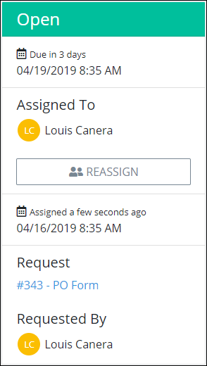

# View a Task Summary

## Summary for an Assigned Task

Follow these steps to view the summary for an assigned Task:

1. [View all assigned Tasks.](view-tasks-you-need-to-do.md#view-your-assigned-tasks) The **To Do Tasks** page displays.
2. Click the name of the Task from the **Name** column. The Task's [form](view-a-task-summary.md#form), Request [data](view-a-task-summary.md#data), and Task [summary](view-a-task-summary.md#summary) display.

Below is an example assigned Task.

### Form

The assigned Task displays in the **Form** tab. The Request participant enters, reviews, and/or makes decisions based on information in the form. These forms are [ProcessMaker Screens](../../designing-processes/design-forms/what-is-a-form.md) designed in [Screens Builder](../../designing-processes/design-forms/screens-builder/).

The **Form** tab displays by default when an assigned Task is opened. Below is an example of a Task displayed in the **Forms** tab.

### Data

The **Data** tab displays the summary of values as entered into a Task from a previous participant of this Request. However, values in the **Data** tab can be changed from those entered by the previous Request participant.

Follow these steps to edit and save the values from those entered by a previous Request participant:

1. View the **Data** tab.
2. From the editable fields in the **Value** column, change the values from those entered by the previous Request participant to those that you want.
3. Click **Save**. The following message displays when the Request values are changed: **Request data successfully updated**.

### Summary

The Task summary displays general information about the assigned Task. The summary displays beside the assigned Task.

If the assigned Task is not overdue, the summary's label displays **Open**.

If an assigned Task is overdue, the summary's label displays **Overdue**.

The following summary displays about an assigned Task:

* **Due:** The **Due** field displays the date and time the assigned Task is due.
* **Assigned To:** The **Assigned To** field displays the avatar and full name of the person assigned the Task.
* **Assigned:** The date and time the Task was assigned displays below the **Assigned To** field. The time zone setting to display the time is according to the ProcessMaker 4 server unless your [user profile's](../profile-settings.md#change-your-profile-settings) **Time zone** setting is specified.
* **Request:** The **Request** field displays the Process name associated with the Request preceded by its numerical iteration. Click the Process name to [view the Request summary](../requests/request-details.md).
* **Requested By:** The **Requested By** field displays the avatar and full name of the person who started the Request. Hover your cursor over a user's avatar to view that person's full name.

## Summary for a Completed Task

The Task summary displays general information about the completed Task. Follow these steps to view the summary for a completed Task:

1. [View all completed Tasks.](view-completed-tasks.md#view-completed-tasks) The **Completed Tasks** screen displays.
2. Click the name of the Task from the **Name** column. The following message displays for the completed Task: **Task Completed**.  

   

   The summary displays for the completed Task.

The following summary displays about a completed Task:

* **Completed on:** The **Completed on** field displays the date and time the Task was completed.
* **Assigned To:** The **Assigned To** field displays the avatar and full name of the person assigned the Task.
* **Assigned:** The date and time the Task was assigned displays below the **Assigned To** field. The time zone setting to display the time is according to the ProcessMaker 4 server unless your [user profile's](../profile-settings.md#change-your-profile-settings) **Time zone** setting is specified.
* **Request:** The **Request** field displays the Process name associated with the Request preceded by its numerical iteration. Click the Process name to [view the Request summary](../requests/request-details.md).
* **Requested By:** The **Requested By** field displays the avatar and full name of the person who started the Request. Hover your cursor over a user's avatar to view that person's full name.

## Related Topics











