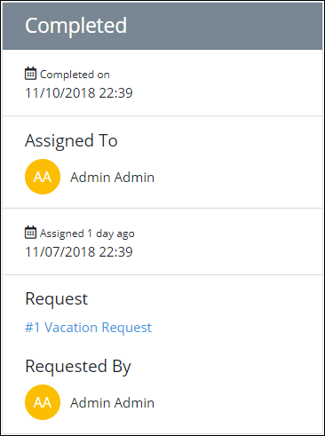

# View a Task Summary

## Overview

## Summary for an Assigned Task

## Summary for a Completed Task

Follow these steps to view information for a completed Task:

1. [View all completed tasks.](view-completed-tasks.md#view-completed-tasks) The **Tasks** screen displays.
2. Click the name of the Task from the **Tasks** column. The following message displays to the left of the completed Task: **Task Completed**.  

   

   The summary displays about the selected completed Task.

The following summary displays about the completed Task:

* **Completed on:** The **Completed on** field displays the date and time the Task was completed.
* **Assigned To:** The **Assigned To** field displays the avatar and full name of the person assigned the Task.
* **Assigned:** The date and time the Task was assigned displays below the **Participants** field. The time zone setting to display the time is according to the ProcessMaker 4 server unless your [user profile's](../profile-settings.md#change-your-profile-settings) **Time zone** setting is specified.
* **Request:** The **Request** field displays the name of the Process associated with the Request. Click the Process name to [view the Request summary](../requests/request-details.md).
* **Requested By:** The **Requested By** field displays the avatar and full name of the person who started the Request.

