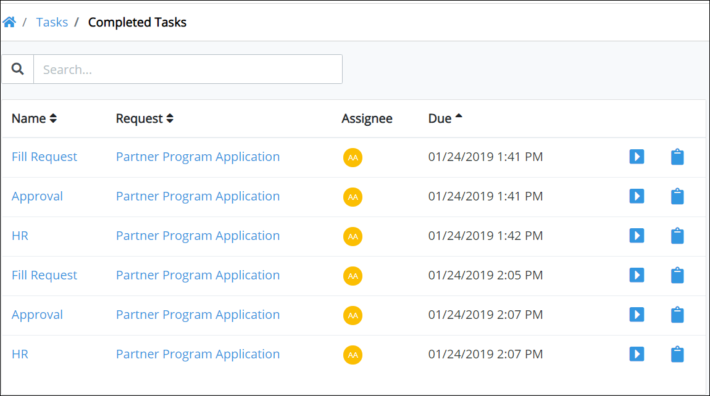
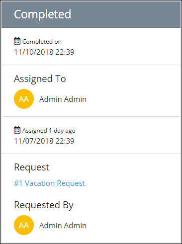

# View Completed Tasks

## View Completed Tasks

Follow these steps to view all completed tasks from all users in your organization:

1. [Log in](../log-in.md#log-in) to ProcessMaker.
2. Click the **Tasks** option from the top menu. The **Tasks** page displays.
3. Click the **Completed** icon . All completed tasks display for all users in your organization.

The **Tasks** page displays the following information about all completed tasks in your organization:

* **Task:** The **Task** column displays the name of the completed task. Click the task name to [view information about the selected task](view-completed-tasks.md#view-information-about-a-completed-task).
* **Request:** The **Request** column displays the name of the process associated with the Request. Click the process name to [view information about that Request](../requests/request-details.md).
* **Assignee:** The **Assignee** column displays the avatar for the username to whom the task was assigned.
* **Due Date:** The **Due Date** column displays the date the task was due.


If there are no completed tasks by anyone in your organization, the following message displays: **No data available**.



[Control how tabular information displays.](../control-how-requests-display-in-a-tab.md)


## View Information About a Completed Task

Follow these steps to view information about a completed task:

1. [View all completed tasks.](view-completed-tasks.md#view-completed-tasks)
2. Click the name of the task from the **Tasks** column. Information displays about the selected completed task.

The following information displays about the completed task:

* **Completed on:** The **Completed on** field displays the date and time the task was completed.
* **Assigned To:** The **Assigned To** field displays the avatar and full name of the person assigned the task.
* **Assigned:** The date and time the task was assigned displays below the **Participants** field.
* **Request:** The **Request** field displays the name of the process associated with the Request. Click the process name to [view information about that Request](../requests/request-details.md).
* **Requested By:** The **Requested By** field displays the avatar and full name of the person who started the Request.

## Related Topics





