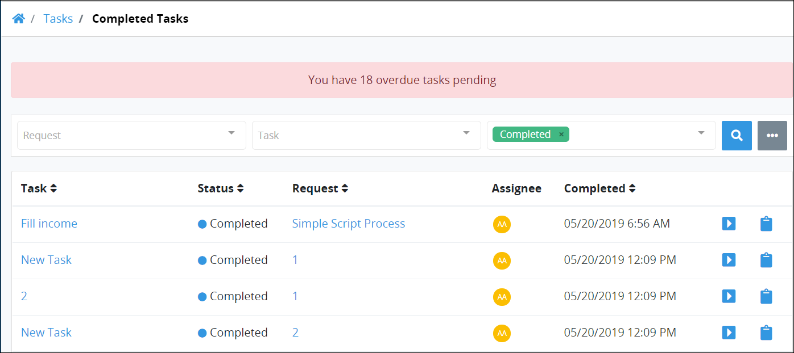

# View Completed Tasks

## View Completed Tasks

Follow these steps to view all completed Tasks from all users in your organization:

1. [Log in](../log-in.md#log-in) to ProcessMaker. The **My Requests** page displays.
2. Click the **Tasks** option from the top menu. The **Completed Tasks** page displays.
3. Click the **Completed** icon in the left sidebar. All completed Tasks display for all users in your organization.

The **Completed Tasks** page displays the following information in tabular format about all completed Tasks in your organization:

* **Task:** The **Task** column displays the name of the completed Task. If you click the Task name, the Task title displays with the following message: **Task Completed** along with [information about the completed Task](view-completed-tasks.md#view-information-about-a-completed-task).
* **Request:** The **Request** column displays the name of the Process associated with the Request. Click the Process name to [view the Request summary](../requests/request-details.md).
* **Assignee:** The **Assignee** column displays the avatar for the username to whom the Task was assigned. Hover your cursor over a user's avatar to view that person's full name.
* **Due:** The **Due** column displays the date the Task was due. The time zone setting to display the time is according to the ProcessMaker 4 server unless your [user profile's](../profile-settings.md#change-your-profile-settings) **Time zone** setting is specified.


### No Completed Tasks?

If there are no completed Tasks by anyone in your organization, the following message displays: **No data available**.

### Display Information the Way You Want It

[Control how tabular information displays](../control-how-requests-display-in-a-tab.md), including how to sort columns or how many items display per page.


## View Information About a Completed Task

Follow these steps to view information about a completed Task:

1. [View all completed tasks.](view-completed-tasks.md#view-completed-tasks) The **Tasks** screen displays.
2. Click the name of the Task from the **Tasks** column. The following message displays to the left of the completed Task: **Task Completed**.  

   

   Information displays about the selected completed Task.

The following information displays about the completed Task:

* **Completed on:** The **Completed on** field displays the date and time the Task was completed.
* **Assigned To:** The **Assigned To** field displays the avatar and full name of the person assigned the Task.
* **Assigned:** The date and time the Task was assigned displays below the **Participants** field. The time zone setting to display the time is according to the ProcessMaker 4 server unless your [user profile's](../profile-settings.md#change-your-profile-settings) **Time zone** setting is specified.
* **Request:** The **Request** field displays the name of the Process associated with the Request. Click the Process name to [view information about that Request](../requests/request-details.md).
* **Requested By:** The **Requested By** field displays the avatar and full name of the person who started the Request.

## Related Topics









