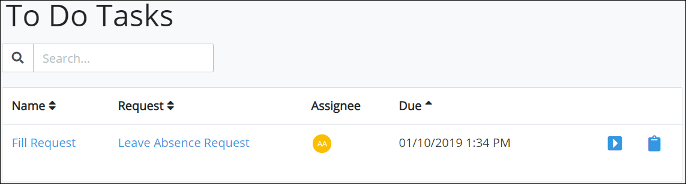

# View Tasks You Need to Do

## View Pending Assigned Tasks

Follow these steps to view your pending assigned tasks:

1. [Log in](../log-in.md#log-in) to ProcessMaker.
2. Click the **Tasks** option from the top menu. The **Tasks** page displays. Tasks that display on this page are assigned to you.


If you are viewing your completed tasks, click the **To Do** icon.


The **Tasks** page displays the following information about your pending tasks:

* **Task:** The **Task** column displays the name of the pending task. Click the task name to open the selected task.
* **Request:** The **Request** column displays the name of the process associated with the Request that is assigned to you. Click the process name to [view information about that Request](../requests/request-details.md).
* **Assignee:** The **Assignee** column displays your avatar since all tasks in this display are assigned to you.
* **Due Date:** The **Due Date** column displays the date the task is due.


If there are no pending assigned tasks, the following message displays: **No data available**.



[Control how tabular information displays.](../control-how-requests-display-in-a-tab.md)


## Related Topics





