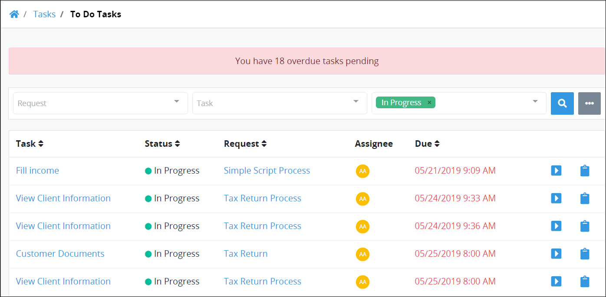

# View Tasks You Need to Do

## View Your Assigned Tasks

Follow these steps to view your assigned Tasks:

1. [Log in](../log-in.md#log-in) to ProcessMaker. The **My Requests** page displays.
2. Click the **Tasks** option from the top menu. The **To Do Tasks** page displays. Tasks that display on this page are assigned to you.


If you are viewing your completed Tasks, click the **To Do** icon in the left sidebar.


The **To Do Tasks** page displays the following information in tabular format about your assigned Tasks:

* **Name:** The **Name** column displays the name of the assigned Task. Click the Task name to open the selected Task.
* **Request:** The **Request** column displays the Process name associated with the Request for the assigned Task. Click the Process name to [view information about that Request](../requests/request-details.md).
* **Assignee:** The **Assignee** column displays your avatar since all Tasks in this display are assigned to you. Hover your cursor over a user's avatar to view that person's full name.
* **Due:** The **Due** column displays the date and time the Task is due. The time zone setting to display the time is according to the ProcessMaker 4 server unless your [user profile's](../profile-settings.md#change-your-profile-settings) **Time zone** setting is specified.


### No Assigned Tasks?

If there are no assigned Tasks, the following message displays: **No data available**.

### Display Information the Way You Want It

[Control how tabular information displays](../control-how-requests-display-in-a-tab.md), including how to sort columns or how many items display per page.


## Related Topics









